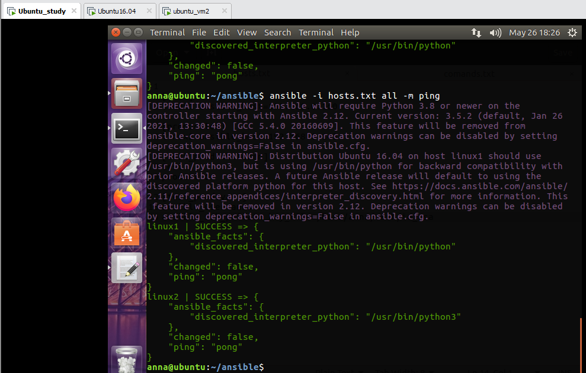
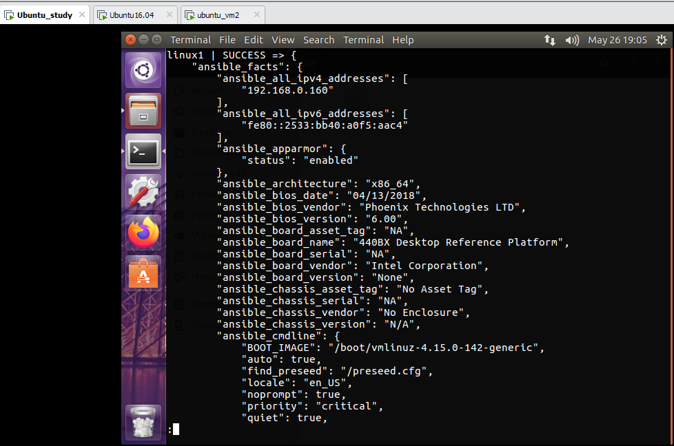
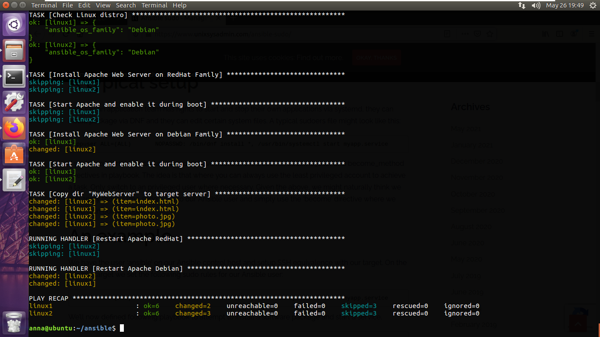
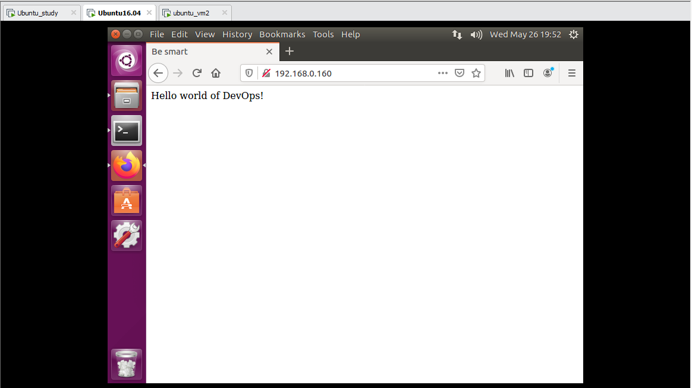
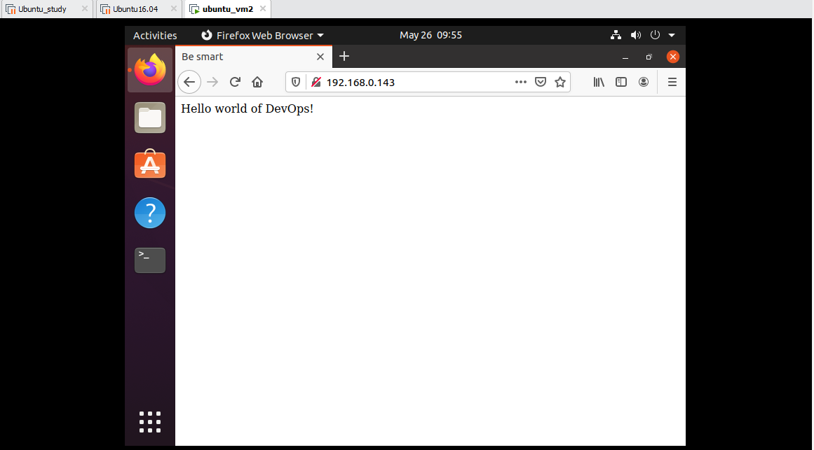

# Module 10 Ansible
## TASK 10.1

First, I created a simple [*hosts.txt*](./hosts.txt) file. An Ansible master has 192.168.0.108 IP address, linux1 has 192.168.0.160 and linux2 has 192.168.0.143.

Then, I used the ping module to ping all the nodes in the inventory.

Also, I used *ansible-inventory* to display the configured inventory.

Then I ran the [*playbook.yml*](./playbook.yml) file with the following file contents:

The result presented in the figures below.

Linux1 

Linux2

