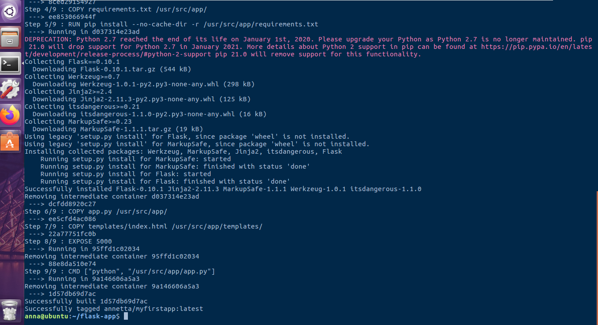
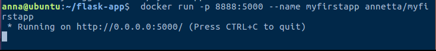
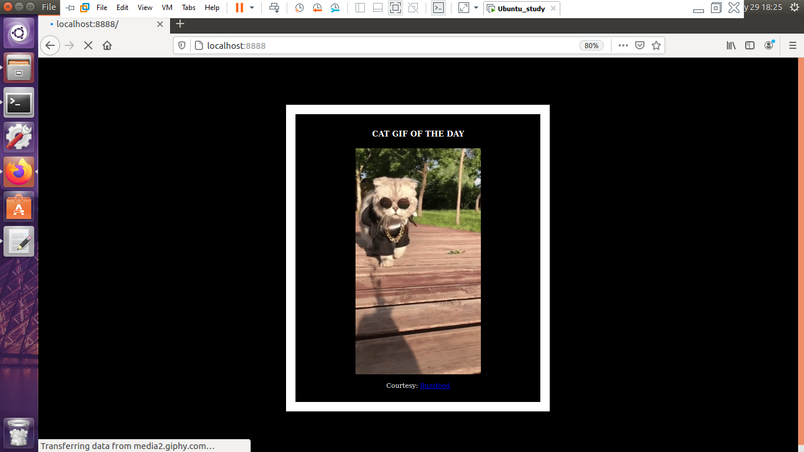
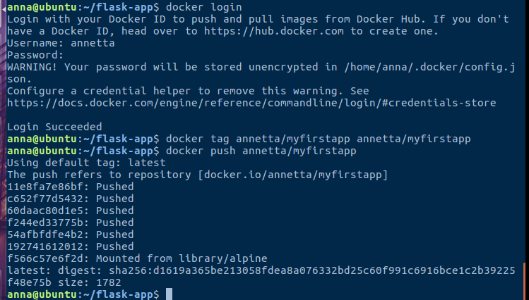
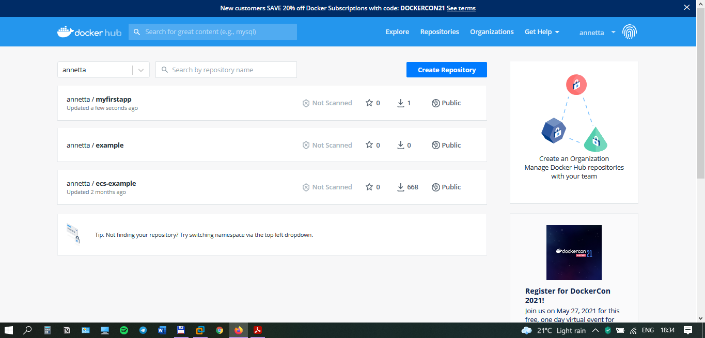

# Module 11 Docker
## TASK 11.1

First, I created a directory called **flask-app** where I created the following files:

- [*flask-app/templates/index.html*](./templates/index.html)
- [*flask-app/app.py*](./app.py)
- [*flask-app/requirements.txt*](./requirements.txt)
- [*flask-app/Dockerfile*](./Dockerfile)

Then I built and ran a docker image. 

Consequently, I got a working webpage.

Also, I pushed the image to the Docker Hub registry.

