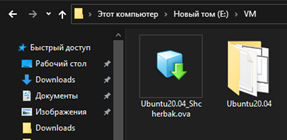

# TASK 2.1

## PART 1. HYPERVISORS

### 1. The most popular hypervisors for infrastructure virtualization

The most popular hypervisors of **type 1** are:

* Microsoft Hyper-V 
* KVM
* VMware vSphere ESXi
* Citrix Hypervisor

The most popular hypervisors of **type 2** are:

* VMware Workstation
* *Oracle Virtual Box
* *OpenVZ

### 2. The main differences of the most popular hypervisors
The following table shows main differences of the most popular hypervisors.

|     **Type 1**     |                |
|--------------------|----------------|
|     Citrix Hypervisor (formerly XenServer)    |     Citrix Hypervisor supports many OS including:   Windows 8 / 10, Windows Server, CentOS 7 / 8, Red Hat Enterprise Linux, SUSE   Linux Enterprise Server, Oracle Linux, Debian Jessie, Ubuntu and so on.     Citrix Hypervisor has a total of 1000 сoncurrent VMs per host. The maximum number of   logical processors per host is now 448 CPUs.      It supports types of virtualization such as   hardware virtualization and paravirtualization.                                                                                                                                    |
|     VMware vSphere ESXi                       |     Unlike Citrix Hypervisor, it also supports full   virtualization. But none of them support operating system virtualization.     ESXi also has the ability to configure 128 CPUs and   120 devices.     VMware ESXi supports key features including traffic   shaping, memory ballooning, role-based security access, logging and auditing.     Admins can manage this functionality using remote   tools instead of a CLI, and ESXI can use an API-based integration model.                                                                                                          |
|     Microsoft   Hyper-V                       |     It allows user to protect VM with encryption.     Hyper-V only supports hardware virtualization.      This hypervisor supports varied Windows and Linux   guest OSes, including Windows XP Service Pack 3, Windows Vista, Windows 7 and   later, along with versions of SUSE Linux Enterprise Server (SLES), Red Hat   Enterprise Linux (RHEL), CentOS, Ubuntu, Debian and Oracle Linux.      The main disadvantage of Hyper-V over VMware is the   lack of USB Redirection. It is required to connect USB hardware to VM.   Instead, Hyper-V offers Discrete Device Assignment.     |
|     **Type 2**                                |                                                                                                                                                                                                                                                                                                                                                                                                                                                                                                     |
|           Oracle VM VirtualBox:               |     VirtualBox is free of charge virtualization in the   form of an open-source hypervisor.     A distinctive feature of the hypervisor is the   ability to work with 64-bit guest operating systems, even if the host   operating system is 32-bit.     Oracle VirtualBox is a cross-platform solution that   can be installed on Linux, Windows, Solaris, macOS, FreeBSD.     VirtualBox has limited support for 3D graphics (up   to OpenGL 3.0, Direct3D 9).      A maximum 128 MB of video memory is supported.                                                                     |
|     VMware   Workstation                      |     In contradistinction to VirtualBox  it has a 30-day trial period available.      VMware Workstation and Player can be installed on   Linux as well as Windows and VMware Fusion can be installed on macOS.     VMware Workstation can create guest operating   systems of Linux, Windows, Solaris, FreeBSD, and macOS.     It also supports hardware virtualization but doesn’t   provide software virtualization like VirtualBox.     VMware Workstation provides 3D graphics with DirectX   10 and OpenGL 3.3. User can set up to 2 GB of video memory.                            |

## PART 2. WORK WITH VMWARE WORKSTATION 15.0

I’ve chosen to use another hypervisor instead of VirtualBox. The reason why I’ve decided to make this choice is my 5 years’ experience of using **VMware Workstation**. And I see a lot of advantages in choosing VMware over VirtualBox.

First of all, the latest stable version  of Ubuntu Desktop 20.04 was installed. Then, I cloned an existing virtual machine (VM) called *Ubuntu20.04_Shcherbak* using cmd command `vmrun clone` presented on the screenshot below.
 

VMware has **folders** that enable to manage multiple virtual machines as a unit. VMware folders are the equivalent of VirtualBox groups. For instance, user can select folder tab with multiple VMs and perform power operations on them at the same time. But VMware delays 10 seconds before powering on next VM by default. If it’s necessary, the time of delay can be modified. Moreover, it’s highly convenient to monitor the state of VMs with a thumbnail option. 

The next step was to create a **branched tree of snapshots**. Snapshot of a virtual machine saves its current state and enables to return to the same state over and over again. A snapshot includes the contents of the virtual machine memory, virtual machine settings, and the state of all the virtual disks.

The **export** feature can be used, for instance, with the purpose of importing by other users or migrating to another hypervisor such as VirtualBox. An exported *.ova* file is a compressed file package that contains VM configuration information and all VM disks. Besides, I’ve noticed that *.ova* file takes less than half the space of an actual VM (the VM folder size is almost 10 GB and the *.ova* file size is 4 GB).

The next step was to configure different **network modes** for VM1, VM2 and check the connection between them. As a result, I made a table that shows the connectivity between VMs and Host for different network modes.

|                    |     VM1 :left_right_arrow: Host    |     VM1 :left_right_arrow: VM2    |     VM1 :arrow_right: Internet    |
|--------------------|:----------------:|:----------------:|:---------------------:|
|     **Bridged**      |         +        |         +        |            +          |
|     **NAT**           |         +        |         +        |            +          |
|     **Host-only**      |         +        |         +        |            -          |
|     **Lan segment**    |         -        |         +        |            -          |

1. With **bridged** network connection, the VM has direct access to an external Ethernet network and has its own IP address on the external network.

2. With **NAT**, the VM and the host system share a single network identity. Besides, the VM don’t have an individual IP address.

3. With **host-only** network, the VM can communicate only with the host system and other virtual machines.

4. A **LAN segment** is a private network that is shared by other virtual machines. Owing to absence of DHCP server (VMware Workstation Pro does not provide a DHCP server for LAN segments) it’s necessary to manually configure IP address of the VM.  

VMware Workstation provides an opportunity to utilize **shared folders**.  Shared folders can be used to share files among virtual machines or between virtual machines and the host system. What I needed to do first was to enable a folder sharing option and set up a folder in VM settings. 
Secondly, I checked whether there were any shared folders using `vmware-hgfsclient` command, then I mounted the folder *Task2.1* to */mnt/*.

Once I had done this, I switched from GUI to command‐line utility `vmrun`. This utility allows user to control VMs and automate operations on them. A few examples of command are presented below.
1. `vmrun listSnapshots` command lists all snapshots in a virtual machine.

2. `vmrun revertToSnapshot` command sets the virtual machine to its state at snapshot time.

3. `vmrun listProcessesInGuest` command lists all processes running in the guest OS.

4. `vmrun  listDirectoryInGuest` command lists contents of the specified directory in the guest OS.

## PART 3. WORK WITH VAGRANT

First, I installed **Vagrant** and initialized the environment with the default Vagrant box. Then I ran `vagrant up` command that creates and configures guest machines according to Vagrantfile. A **Vagrantfile** is a configuration file that describes an environment. After doing that, I [connected](./Screenshots/Screenshot10.png) to the VM using the program PuTTY. 

And I did the [same](./Screenshots/Screenshot11.png) using PowerShell with command `vagrant ssh default` to connect to my newly created VM.

In addition, I used `vagrant global-status` in order to view a list of machines, along with the state and directory where the Vagrantfile is located.

Virtual machines aren’t stored next to the Vagrantfile, they’re stored in the current system user's home directory. A typical location on Linux is *~/VirtualBox VMs/*, on Windows [*C:\Users\username\VirtualBox VMs\\*](./Screenshots/Screenshot13.png).

The next step was to **create my own Vagrant box**. For this I created a new virtual machine using Ubuntu Server 16.04 OS with a port-forwarding rule for SSH and a set of other configurations such as
* setting root password
* setting up super user
* updating the operating system
* installing the vagrant key
* installing and configuring openssh server
* installing Guest tools.

After this, I packaged up the box with the help of `vagrant package --base vagrant-ubuntu_server` command and added created box to Vagrant using `vagrant box add vagrant-ubuntu_server package.box`. 
I ran previously created VM (you can see the process on the [screenshot](./Screenshots/Screenshot14.png)) and connected via ssh to it.

Next, I created [Vagrantfile](./Files/Vagrantfile) where I configured two VMs (both are Ubuntu 14.04 LTS):

1. *DHSP server*
2. *Client*

In addition, the [*script_DHCP.sh*](./Files/script_DHCP.sh) file was created, in order to upload and execute a script within the VM *DHSP_server* using Vagrant Shell provisioner. 
Once I’d done this, I connected to *Client* and ran `ifconfig` to verify if the VMs had been configured correctly. As you can see from the [screenshot](./Screenshots/Screenshot15.png), the *Client* got an IP address from a *DHCP_server* and two Vagrant environments appeared on the system.

