# TASK 2.2

I created my own Amazon Linux instance in Amazon Lightsail and connected to it.

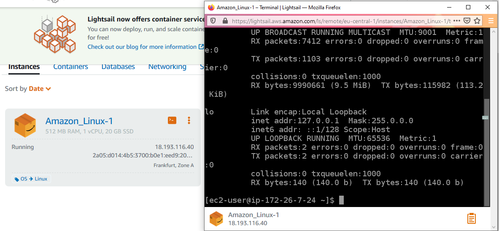

In order to launch Linux Virtual Machine without Amazon Lightsail I used **Amazon EC2** and launched **CentOS 7**. During this process, I created a key pair to log in to the instance securely and changed permission of the private key file so that only I could read it. Besides, I configured a Security Group and added inbound and outbound rules to be able to connect via SSH.
Having done this, I made attempt to connect to newly launched instance using `ssh` and it was a success.

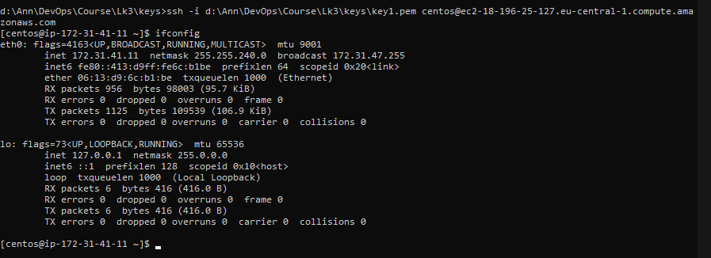

Then, I created a [snapshot](./Screenshots/Screenshot3.png) of CentOS. And in future it could be used as a baseline for new volumes or for data backup.

I created and attached a completely new volume **Disk_D** (General Purpose SSD) using **Amazon EBS** as a secondary storage. Along with this, I formated the volume with file system and then mounted it on CentOS by doing this steps:

1. I checked if there was any file system on the volume using `sudo file -s /dev/xvdf`.
2. I used the `sudo mkfs -t xfs /dev/xvdf` command to create a file system on the volume.
3. I also created a mount point and mounted the volume at that directory.
4. In order to mount an attached EBS volume on every system reboot, an entry for the device was added to the */etc/fstab* file.

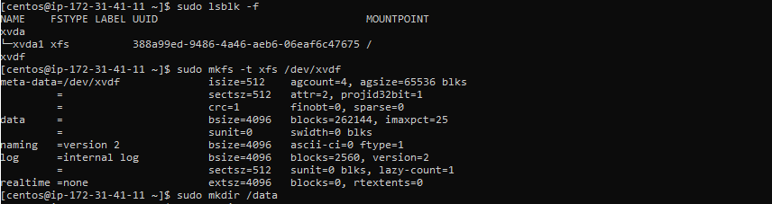

Additionly, a new file *file1.txt* was created on this volume.

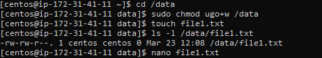

I launched the third instance **CentOS_2** from previously created snapshot and detached Disk_D from the 2nd instance and attach it to the new instance.

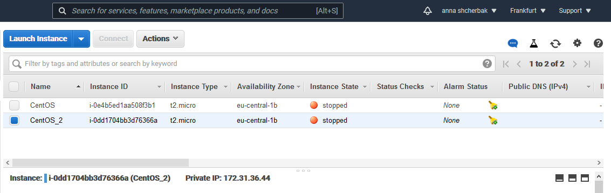

The next step was to launch and configure a WordPress instance with **Amazon Lightsail**. Getting the website up and running with Lightsail was pretty straightforward and it took less then 10 minutes to do. I used [**freenom.com**](https://www.freenom.com/en/index.html) to register a new domain. There I configured  addresses of nameservers and added DNS A record.

As a result, the [site](./Screenshots/Screenshot7.png) was up and running.

 Then, I created an **Amazon S3** bucket, uploaded a file, retrieved it and deleted it via **AWS CLI**.

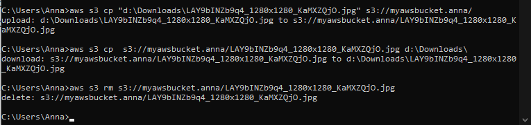

I configured and deployed  Docker Container, attached a load balancer to an Amazon ECS service and launched a web [application](./Screenshots/Screenshot9.png). 

Additionally, I created my own Docker image and deployed it to AWS. To deploy a Docker image to AWS, it must be available in a Docker registry so that AWS can download it from there. So, I utilized **Amazon Elastic Container Registry (ECR)** as well as **Docker Hub** to publish it. Also, AWS uses AWS Fargate that provides on-demand, right-sized compute capacity for containers.

### 1. Deploying application using Docker Hub.

1.1 I created a repository at <https://hub.docker.com>.

1.2 A Docker image from a simple “Hello World” application that prints “Hello AWS” was created in order to deploy to AWS.

```
docker build -t ecs-example .
```
1.3 I tagged and pushed Docker image to the repository.

```
docker tag ecs-example annetta/ecs-example:v1
docker push annetta/ecs-example:v1
```

And after that, the [image became available](./Screenshots/Screenshot1.1.png) in the Docker Hub.

1.4 So then I had the project containerised and published. Finally, I could proceed to deployment. The process of deployment on Amazon ECS consists of:

- Container configuration 
- Task configuration 
- Service configuration 
- Cluster configuration 

At the *Container definition* step the URL of the previously published Docker image had to be specified.

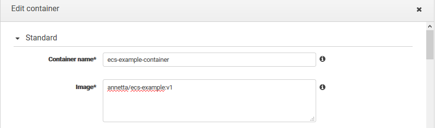

1.5 When all steps were completed, I used IP-address of application to view it. The result presented on this [screenshot](./Screenshots/Screenshot1.10.png). As mentioned above this simple application prints “Hello AWS”.

### 2. Deploying application using Amazon Elastic Container Registry.

The process of publishing the image to Amazon ECR was somewhat different.
       
2.1 The repository in Amazon ECR should be created.

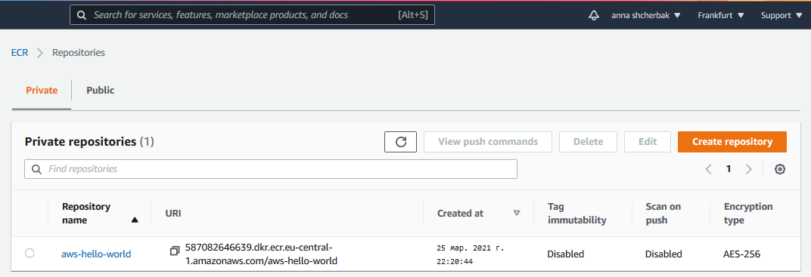

2.2 I skipped the step where the image had to be built, because I’d already built it earlier.

2.3 Then several commands had to be executed.

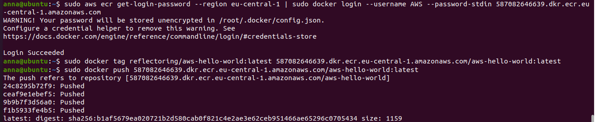

The first command retrieved an authentication token and authenticated a Docker client to the registry to allow it to push the images to the AWS ECR repository.

Once it had been done, I tagged the image.
At last, I had to run the docker `push` command to push the tagged image to my newly created repository.
When it had been done, I went to AWS ECR, opened the repository, and saw the uploaded image.

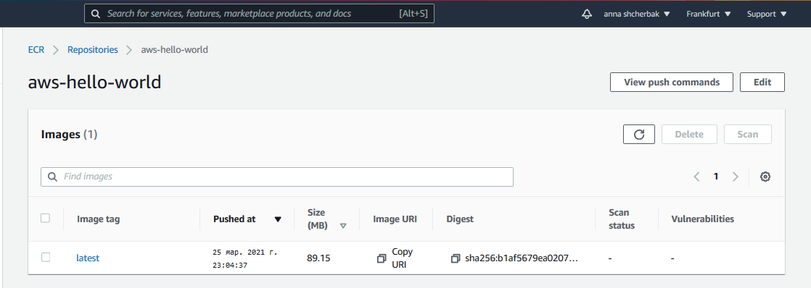

2.4 I repeated step 1.4, except I inserted the URL of the image in AWS ECR.

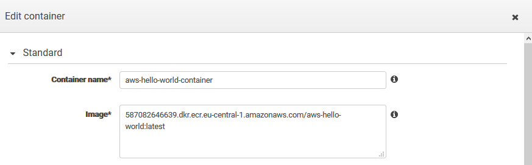

 2.5 On the Cluster tab cluster details were [displayed](./Screenshots/Screenshot1.7.png). The next step was to verify that the application was successfully deployed. This could be done using public [IPv4 address](./Screenshots/Screenshot1.8.png) or public [IPv4 DNS](./Screenshots/Screenshot1.9.png).

Last but not least, I created a static [website](http://annashcherbak.ga/) on Amazon S3 that is publicly available.
I used already registered domain and I added a DNS CNAME entry to point to the Amazon S3 website endpoint. Consequently, requests to <http://annashcherbak.ga/> are routed to <http://myawsbucket.anna.s3-website.eu-central-1.amazonaws.com/>.

PS. If you use <http://annashcherbak.ga/> link, site may not load on the first try, please reload the page again, or use [this link](<http://myawsbucket.anna.s3-website.eu-central-1.amazonaws.com/>).
