# Module 3 Database Administration

## TASK 3.1

### PART 1

I created a **Book store** database (DB). The сreation process of one of the main tables:

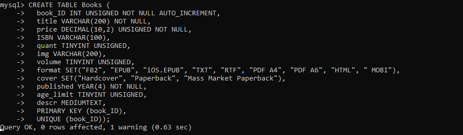

As a result, thirteen tables were created (the list of tables is presented in this [figure](./Images/Screenshot2.png) ). 

Besides, I generated the [EER Diagram](./Images/EER_Diagram.png) using *Reverse Engineer* function in MySQL Workbench for illustrative purposes.

Then, I filled in several tables. In the figure below is shown the commands I used to fill in *"authors"* and *"books"* tables.

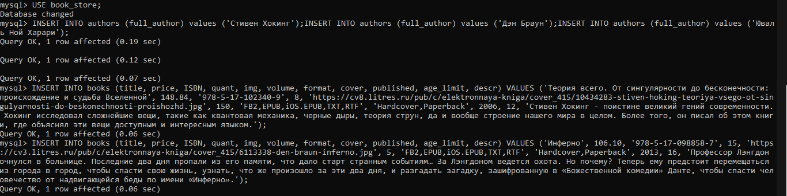

Once, I’d done this, I began to execute various queries. For instance, in order to find out how many books each author had, I executed this query:

```
SELECT COUNT(Books_book_ID), authors.full_author FROM authors_books inner join authors on authors_books.Authors_author_id=author_id GROUP BY Authors_author_id;
```

Next query I used to display books that are available in FB2 and EPUB formats and has price between 200 and 400.

```
SELECT book_ID, title, price, format, published from books where format LIKE '%FB2%EPUB%' AND price BETWEEN 200 AND 400;
```

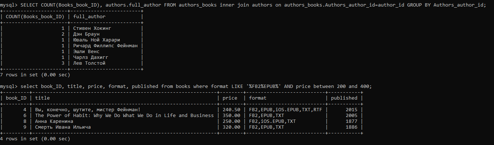

There are *”books”* and *”authors”* tables in my database. And the relationships between them is given in a third table called *”authors_books”*. In order to get one table with all the books and authors who wrote these books I used `INNER JOIN` keyword.

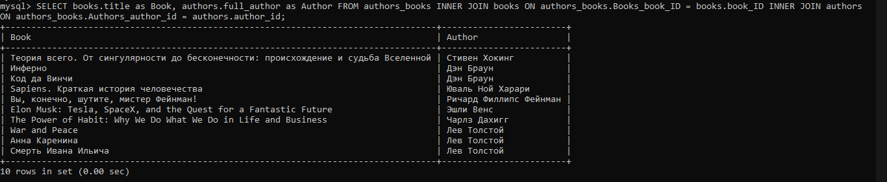

To roughly classify books into “modern” and “old” the `IF()` function was executed.

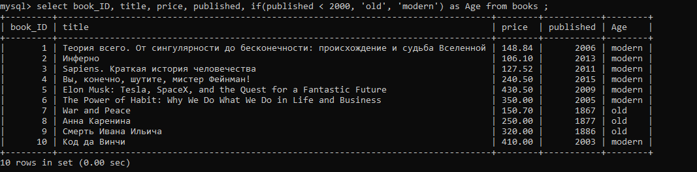

Also the `UPDATE` statement [was used](./Images/Screenshot7.png) to modify the existing records in a table.

In addition, I created **[procedure](./procedure.sql)** to determine whether the store had any books that were running out of stock. If there are any books the number of which is less than 50, the procedure will generate a table with such books.

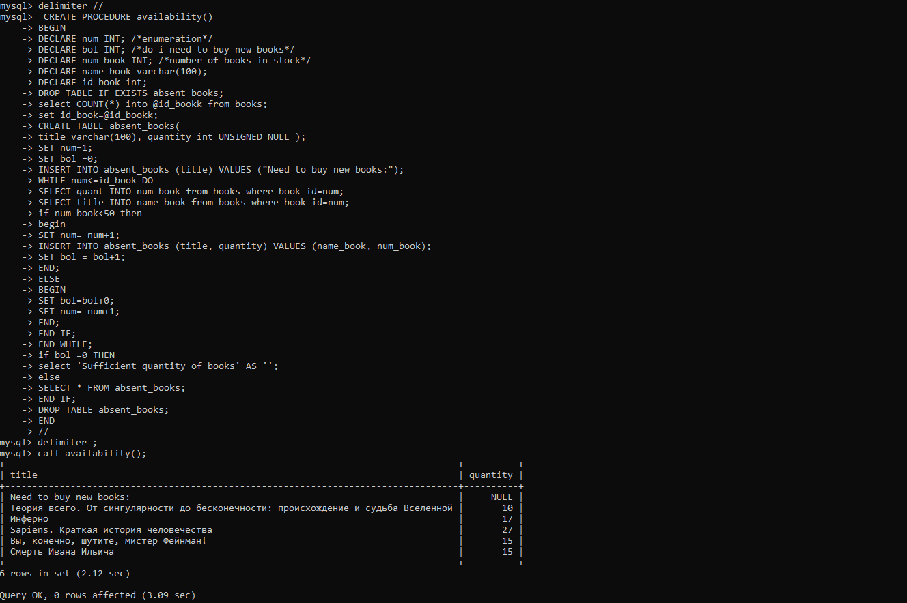

The next step was to create users with different privileges and verify their access to certain actions. I [created user *annashcherbak*](./Images/Screenshot9.png) with [*SELECT* privilege](./Images/Screenshot10.png) on book_store DB for this purpose. To verify that the new granted privileges had been applied, I connected to DB as *annashcherbak* and attempted to create a table. As a result, this action was denied.

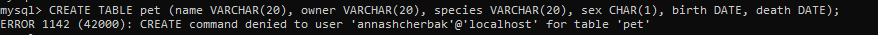


Then, I revoke existing privileges from this user and granted with *INSERT* (on book_store DB) and *GRANT OPTION* (on all DBs). As a consequence of that, the user was allowed to grant to or revoke from other users those privileges that he or she yourself possessed. Because of this, user was prohibited to grant to other users any privileges except *INSERT* and furthermore, only within *book_store* DB, as shown in the figure below.

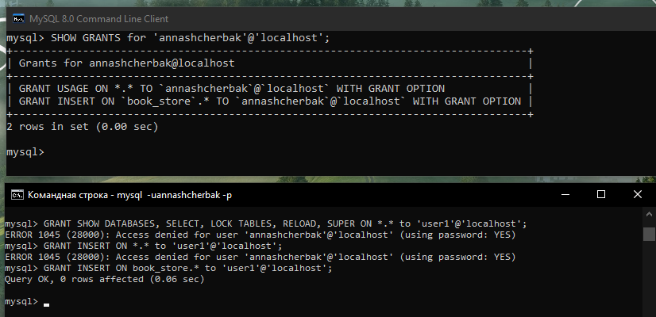

For example, to get a list of all MySQL users’ accounts including information about the password (hashed) and host I used the following query:

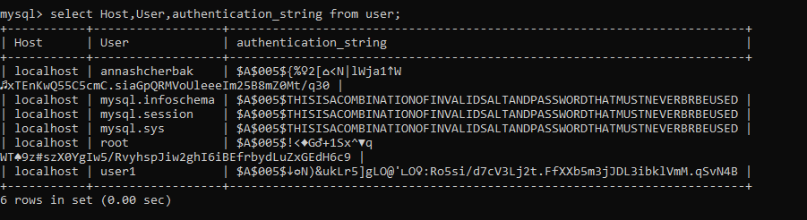

### PART 2

To make backup of the whole database the following command was used:

```
mysqldump -u root -p book_store > D:\\backup.sql
```

After deleting one of the tables in the DB, I restored it from [“D:\\backup.sql” file](./backup.sql) . It brought about the recovery of the deleted table.

```
mysql -u admin -p book_store < d:\\backup.sql
```

What I needed to do first to transfer my local DB to Amazon RDS was to [create a MySQL DB instance](./Images/Screenshot14.png) using Amazon RDS.
Once I'd done this, I connected to created Amazon RDS database using Windows cmd, then I created an empty DB with the same name as my local DB and transferred backupfile *"D:\\backup.sql"* on it. 

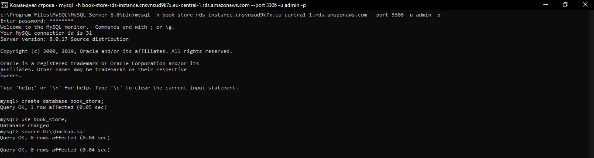

To verify that the transfer process was successful I executed the same query in both databases.

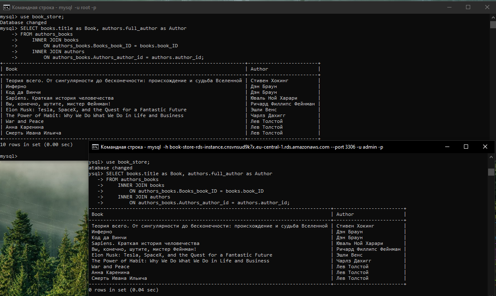

### PART 3

I created an Amazon DynamoDB table with both Partition key and Sort key, entered data into this table and executed queries using Query and Scan.

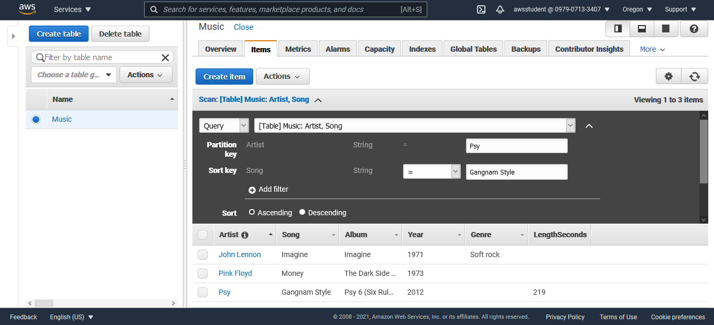
