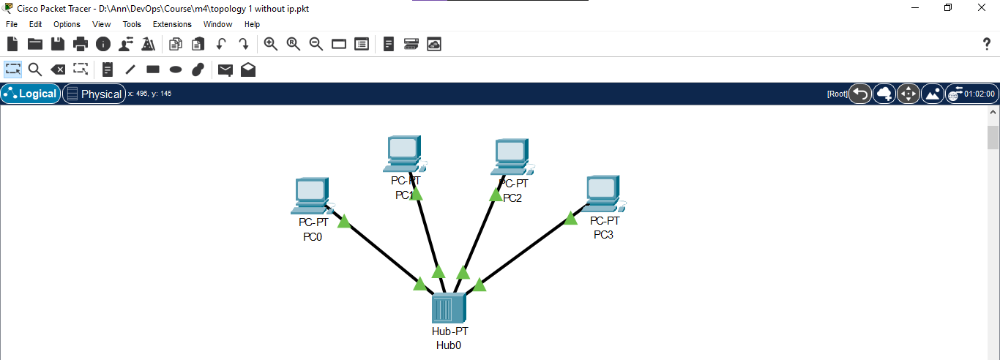
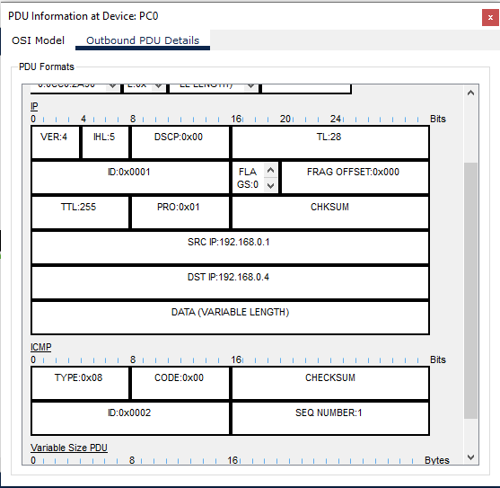
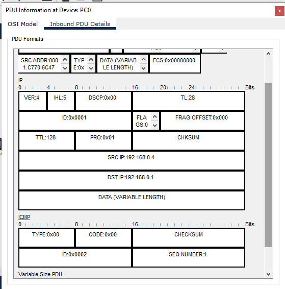
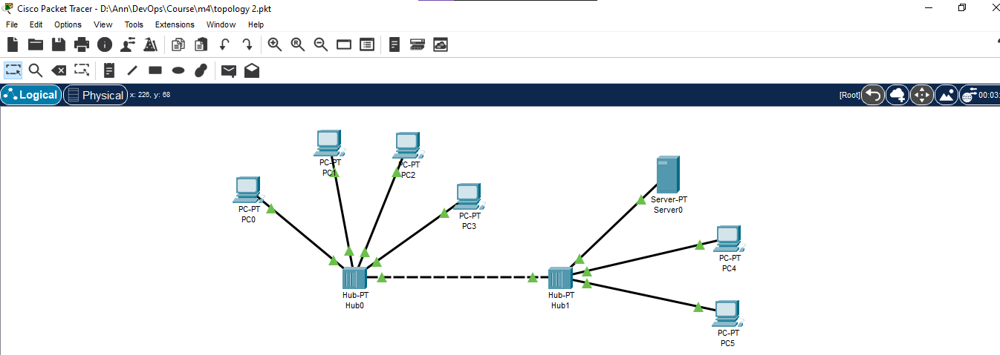
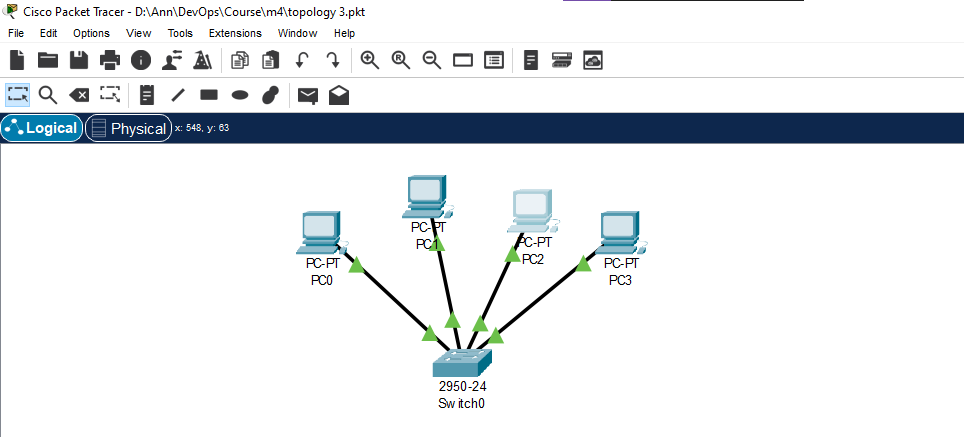
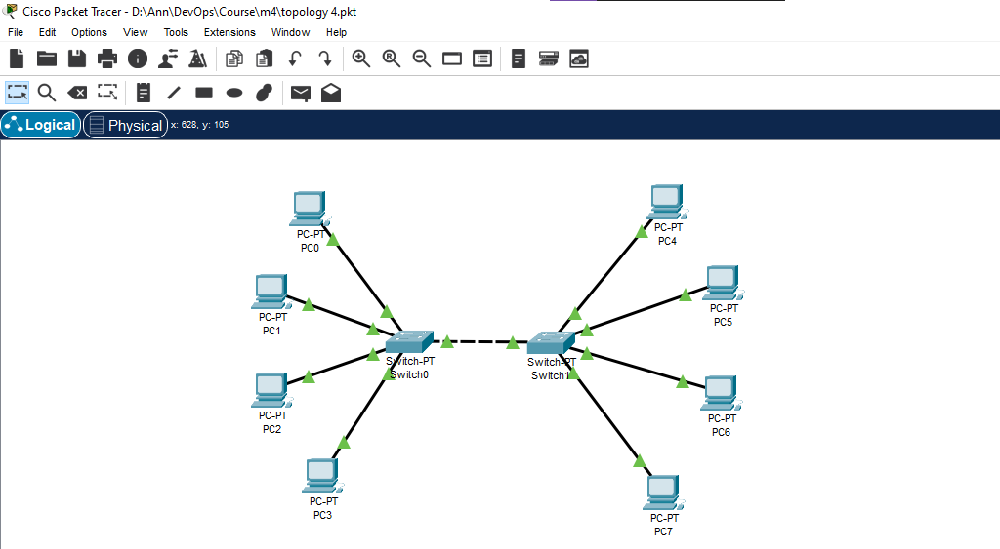
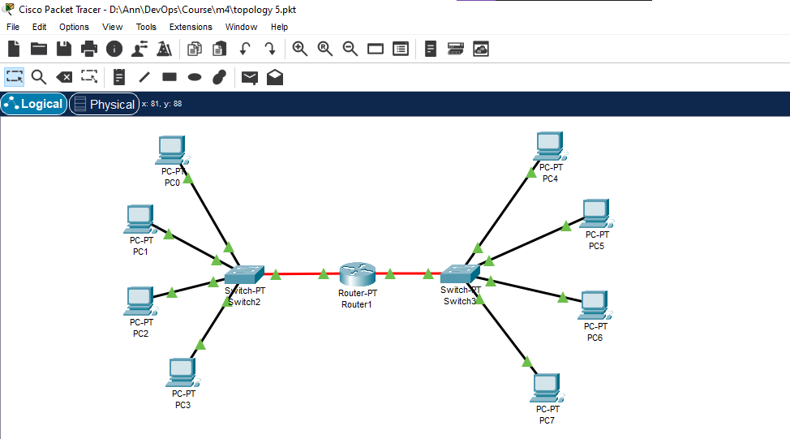
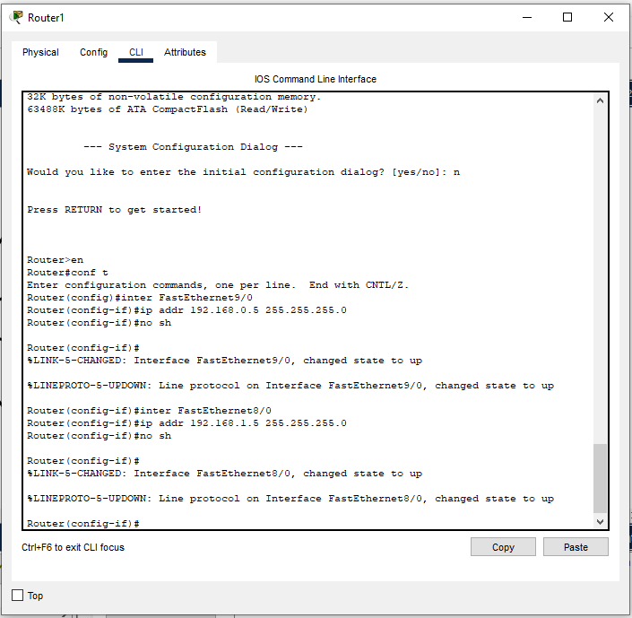
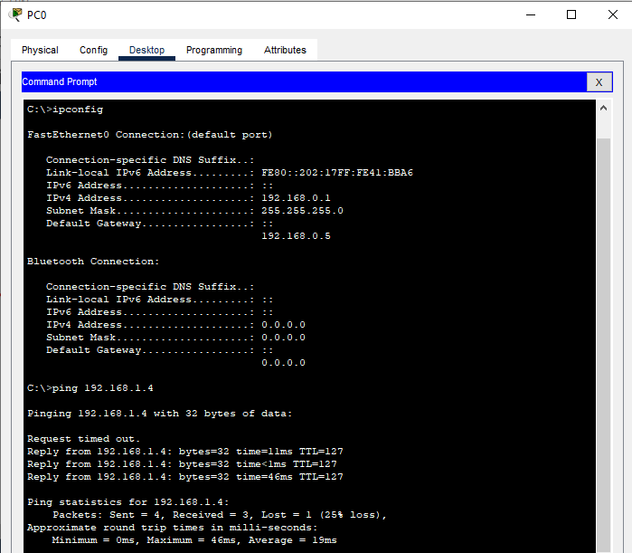

# Module 4 Networking Fundamentals

## TASK 4.1

I build the first topology and assigned IP addresses.

Then I used simulation mode to see packets flowing from one node to another ([video of traffic moving through the network](./Video/Topology1.mp4), [.pkt file](./Topologies/topology1.pkt)). 

First, the ARP request was sent with broadcast MAC (FFFF.FFFF.FFFF.FFFF), the reason way it happened was absence of MAC address of destination PC in ARP table. It had to first learn this by broadcasting a frame to all local devices, asking for the one with the specific IP address to reply with its MAC address. Only after this process, when computer had learned that the destination IP address had been mapped to the specific MAC address, the ICMP packet could be transmitted. The first ICMP packet is shown in the figure below.

From this screenshot not only can we see the destination and source IP addresses, but we also can see ICMP type 0x08 which indicates that it was *Echo request*. As soon as the destination PC received ICMP request, it sent ICMP reply message (type 0x00).

Then, I deleted IP addresses of PCs and checked the state of the network. Without an assigned IP address packets could not be transmitted. If a computer is unable to configure a valid IP address, it can't connect to a network.

The next step was to build second topology with two hubs ( [video](./Video/Topology2.mp4) of traffic moving through this network, [.pkt file](./Topologies/topology2.pkt)). This network worked perfectly on condition that the necessary IP addresses were configured correctly. 

The third topology with one switch was configured ( [video](./Video/Topology3.mp4) of traffic moving through this network, [.pkt file](./Topologies/topology3.pkt)).

As soon as, IP addresses from all hosts were deleted, the network couldn’t function. It can be attributed to the fact that if port doesn’t have an IP address, the device drops the packet. 

There is a big difference between a hub and switch. When a hub receives a packet of data (an Ethernet frame) at one of its ports from a network device, it repeats the packet to all its ports to all the other network devices. Whereas switch can decide which computer is the message intended for and send the message directly to the right computer.

The fourth topology with two switches was configured ( [video](./Video/Topology4.mp4) of traffic moving through this network, [.pkt file](./Topologies/topology4.pkt)).

Once I had done this, I built the fifth topology with router, two switches and two subnetworks ([video](./Video/Topology5.mp4) of traffic moving through this network, [.pkt file](./Topologies/topology5.pkt)).

The commands that I used to configure router are shown in the screenshot below.

I used `ping` command in order to verify a connection between two networks.

Unlike the fourth topology, the fifth one had two different networks. This example clearly demonstrates that router usually connects at least two networks together, such as two LANs, two WANs or a LAN and its ISP network.

Router is very different from the switch because it is for routing packet to other networks. It is also more intelligent and sophisticated to serve as an intermediate destination to connect multiple area networks together. Routers can calculate the best route for sending data and communicate with each other by protocols. Moreover, switches work on the data link layer of the OSI model, whilst routers work on the network layer of the OSI model.

Consequently, the switch aims to determine the destination address of the received IP packet and forward it to the destination address. On the other hand, the router's main purpose is to find the smallest and best routes for the packets to reach the destination, determined using the routing table.

