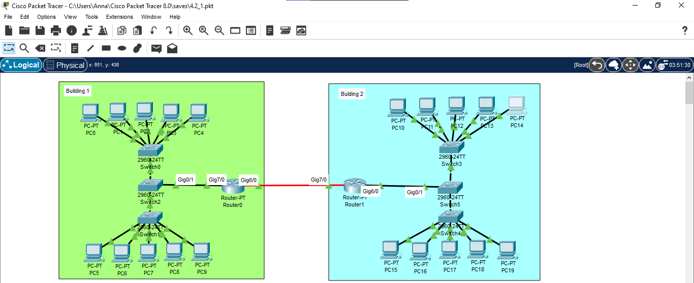
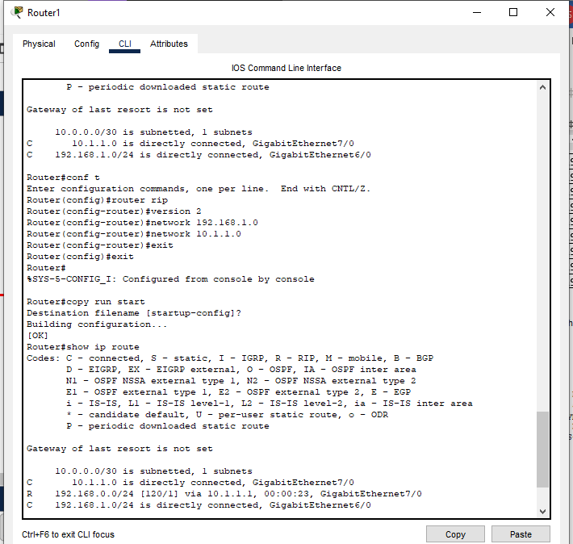
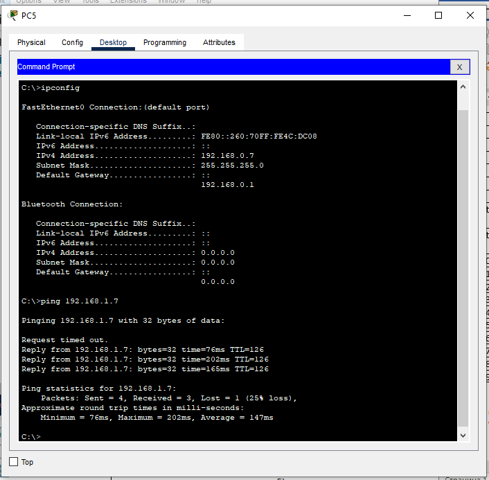
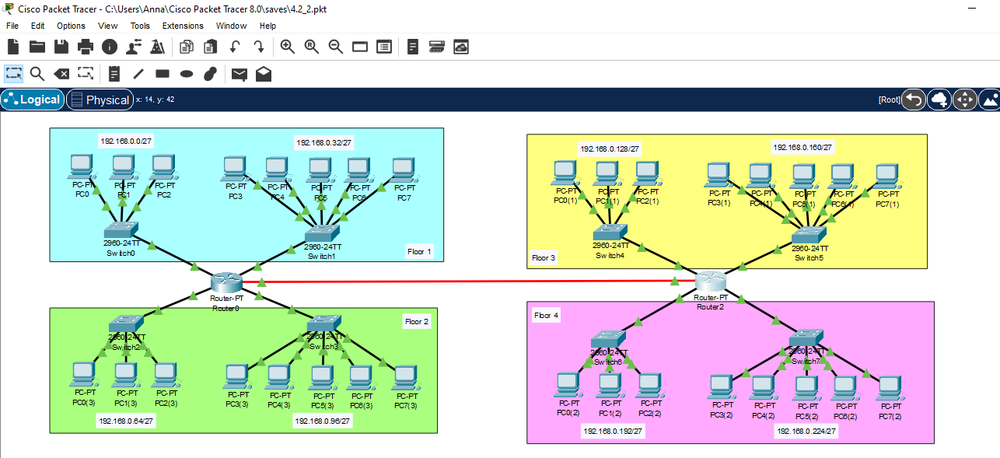
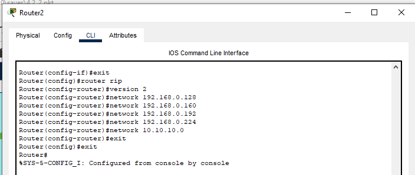
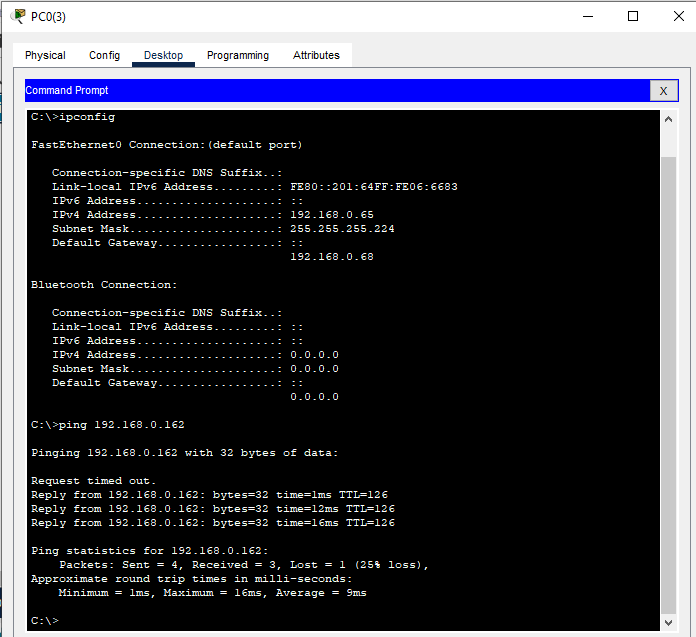
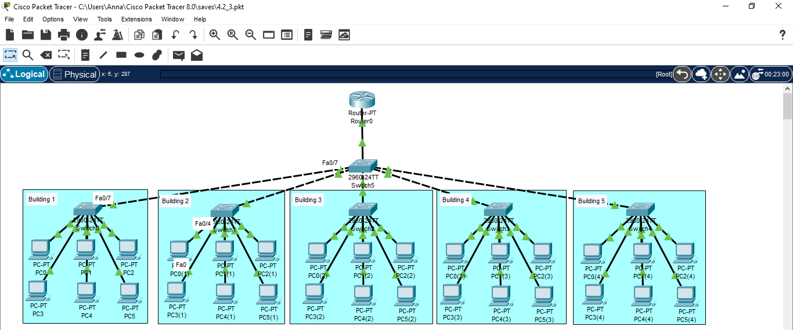
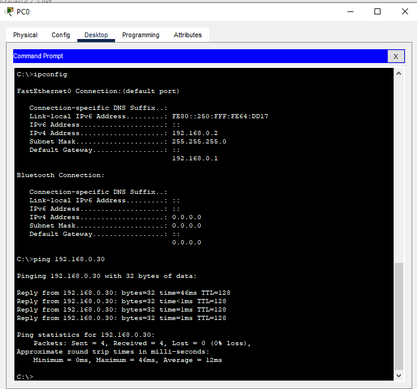

# Module 4 Networking Fundamentals

## TASK 4.2

### Exercise 1

I built an enterprise network that contained 2 buildings with 2 floors in each. Each floor consists of one workgroup of 5 computers.



In the first building I used 192.168.0.0/24 network, in the second 192.168.1.0/24 network was used. I used switches to connect hosts in one network because they allow different devices on a network to communicate, whereas the two routers were used to connect different networks. Addressing table that was used is shown below.
 

|     Device     |     Interface             |     IP Address      |     Subnet Mask        |     Default Gateway    |
|----------------|---------------------------|---------------------|------------------------|------------------------|
|     PC0        |     NIC                   |     192.168.0.2     |     255.255.255.0      |     192.168.0.1        |
|     PC1        |     NIC                   |     192.168.0.3     |     255.255.255.0      |     192.168.0.1        |
|     PC2        |     NIC                   |     192.168.0.4     |     255.255.255.0      |     192.168.0.1        |
|     PC3        |     NIC                   |     192.168.0.5     |     255.255.255.0      |     192.168.0.1        |
|     PC4        |     NIC                   |     192.168.0.6     |     255.255.255.0      |     192.168.0.1        |
|     PC5        |     NIC                   |     192.168.0.7     |     255.255.255.0      |     192.168.0.1        |
|     PC6        |     NIC                   |     192.168.0.8     |     255.255.255.0      |     192.168.0.1        |
|     PC7        |     NIC                   |     192.168.0.9     |     255.255.255.0      |     192.168.0.1        |
|     PC8        |     NIC                   |     192.168.0.10    |     255.255.255.0      |     192.168.0.1        |
|     PC9        |     NIC                   |     192.168.0.11    |     255.255.255.0      |     192.168.0.1        |
|     Router0    |     GigabitEthernet7/0    |     192.168.0.1     |     255.255.255.0      |                        |
|                |     GigabitEthernet6/0    |     10.1.1.1        |     255.255.255.252    |                        |
|     Router1    |     GigabitEthernet6/0    |     192.168.1.1     |     255.255.255.0      |                        |
|                |     GigabitEthernet7/0    |     10.1.1.2        |     255.255.255.252    |                        |
|     PC10       |     NIC                   |     192.168.1.2     |     255.255.255.0      |     192.168.1.1        |
|     PC11       |     NIC                   |     192.168.1.3     |     255.255.255.0      |     192.168.1.1        |
|     PC12       |     NIC                   |     192.168.1.4     |     255.255.255.0      |     192.168.1.1        |
|     PC13       |     NIC                   |     192.168.1.5     |     255.255.255.0      |     192.168.1.1        |
|     PC14       |     NIC                   |     192.168.1.6     |     255.255.255.0      |     192.168.1.1        |
|     PC15       |     NIC                   |     192.168.1.7     |     255.255.255.0      |     192.168.1.1        |
|     PC16       |     NIC                   |     192.168.1.8     |     255.255.255.0      |     192.168.1.1        |
|     PC17       |     NIC                   |     192.168.1.9     |     255.255.255.0      |     192.168.1.1        |
|     PC18       |     NIC                   |     192.168.1.10    |     255.255.255.0      |     192.168.1.1        |
|     PC19       |     NIC                   |     192.168.1.11    |     255.255.255.0      |     192.168.1.1        |

Not only did I assign IP addresses and default gateways, but I also configured an RIP (Routing Information Protocol) routing protocol. The reason way I did this was absence of a route to the remote network on the routing tables of the routers. Without this protocol pinging is not possible across the two sub-networks. Owing to this fact, router was dropping the packets, before I configured it. 

The commands that I used on the Router1 to configure RIP protocol is presented in the figure below.



Similarly, I configured the Router0 but with one difference which was the following line instead of `network 192.168.1.0`. 

```
network 192.168.0.0
```

By using these commands, I added networks directly attached to each router. Consequently, all routers were communicating, and each advertised information about the networks attached to it.

Once I’d done this, I verified that connection had been successfully established between the networks. To do this I used `ping` command on PC5 (Building 1) to ping PC15 (Building 2).



As you can see in the figure above, the connection was established successfully. 

### Exercise 2

I built an enterprise network in a building that contained 4 floors. Each floor consisted of two workgroups of 3 and 5 computers, respectively.



Each workgroup had its own subnetwork, moreover, one router was allocated for two networks to avoid overload. If one router had malfunctioned, the other would have kept working. Thus, the four remaining subnetworks would have operated properly.

Network with IP address 192.168.0.0/24 was taken as the basis and divided into eight subnetworks with subnet mask /27 or 255.255.255.224.

|     Number of subnetwork    |     IP address of subnetwork    |     First possible IP address    |     Last possible IP address    |
|:-----------------------------:|---------------------------------|----------------------------------|---------------------------------|
|     1                       |     192.168.0.0                 |     192.168.0.1                  |     192.168.0.30                |
|     2                       |     192.168.0.32                |     192.168.0.33                 |     192.168.0.62                |
|     3                       |     192.168.0.64                |     192.168.0.65                 |     192.168.0.94                |
|     4                       |     192.168.0.96                |     192.168.0.97                 |     192.168.0.126               |
|     5                       |     192.168.0.128               |     192.168.0.129                |     192.168.0.158               |
|     6                       |     192.168.0.160               |     192.168.0.161                |     192.168.0.190               |
|     7                       |     192.168.0.192               |     192.168.0.193                |     192.168.0.222               |
|     8                       |     192.168.0.224               |     192.168.0.225                |     192.168.0.254               |

The RIP protocol was configured, just like it was done previously. 



Then, I verified connection among all subnetworks. Example of ping command from PC0(3) in 192.168.0.64/27 subnetwork to PC3(1) in 192.168.0.160/27 subnetwork is presented in the figure below. 



### Exercise 3

The LAN of a complex of 5 one-storey buildings was modeled where each of buildings had one working group of 6 computers. All computers were in one network 192.168.0.0/24 so that they could easily communicate with each other. In order to manage load balancing, each working group was connected to one switch which, in turn, was connected to main one.



As a consequence of this, the network was successfully configured. 

