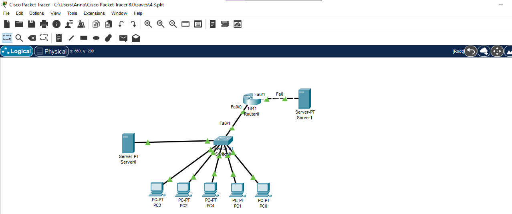
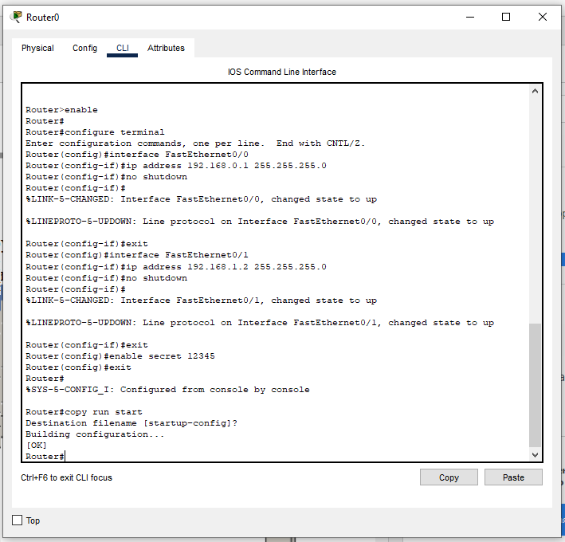
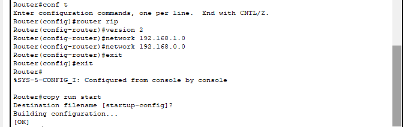
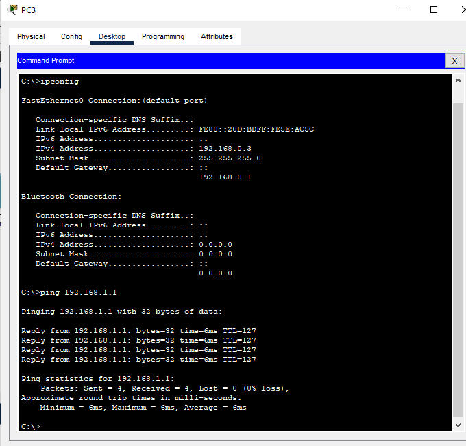

# Module 4 Networking Fundamentals

## TASK 4.3

I built a local area network (LAN) consisting of a switch, 5 computers and a server. The switch was connected to a router to which the server was also connected.

Then I assigned IP addresses in accordance with the assignment. As it is shown in the figure below, the proper IP address were configured on the router, thus the router’s interface FastEthernet0/0 connected to 192.168.0.0/24 network, whereas interface FastEthernet0/1 connected to 192.168.1.0/24 network. Besides, I enabled password to access Privileged EXEC mode. The reason why it’s extremely important to set password here is that Privileged EXEC mode is where all the dangerous commands are located, including access to Global Configuration mode.

After having done this, I configured an RIP routing protocol on the Router0. I added networks that was directly attached to the router.

As far as I’m concerned, it was no use configuring RIP protocol in this particular network, because there was no other router with which Router0 could communicate. The example of appropriate use of RIP protocol between two router you can look in the [exercise 2 of task 4.2](https://github.com/anna-shcherbak/DevOps_online_Kharkiv_2021Q2/tree/main/m4/Task4.2#exercise-2). 

Consequently, the LAN was up and running properly. I chose the PC3 in order to ping the Server1 that was in another network.
You also can watch a [video](./Video_task4.3.mp4), where I used Simulation mode to visually present the results.

