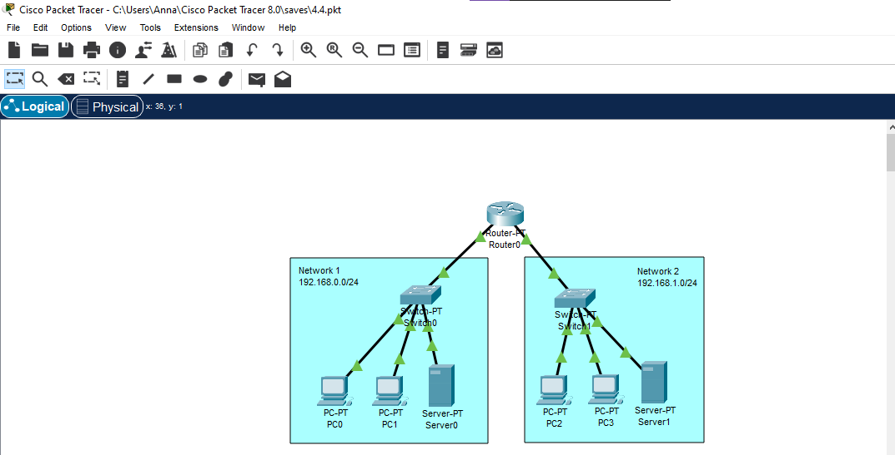
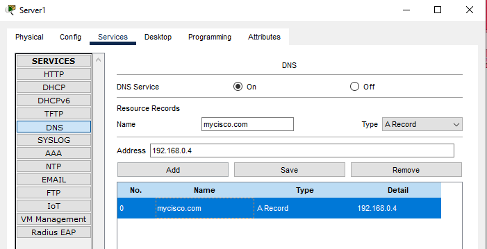
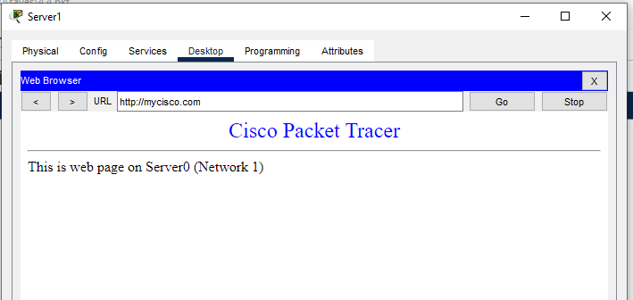
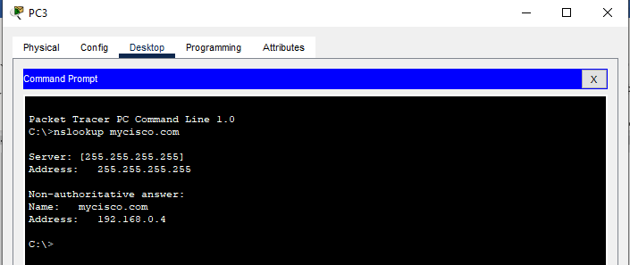

# Module 4 Networking Fundamentals

## TASK 4.4

### Exercise 1

I’ve already done this task earlier ([Task 4.2 exercise 1]( https://github.com/anna-shcherbak/DevOps_online_Kharkiv_2021Q2/tree/main/m4/Task4.2#exercise-1) and [exercise 2]( https://github.com/anna-shcherbak/DevOps_online_Kharkiv_2021Q2/tree/main/m4/Task4.2#exercise-2)).

### Exercise 2

I built the given topology with two subnetworks (Network 1 had 192.168.0.0/24 IP address, Network 2 had 192.168.1.0/24 IP address). The static IP addresses, default gateways were assigned to all nodes as well as DNS server IP addresses. For Network 1 the IP address of DNS server was 192.168.0.4/24, for Network 2 the IP address of DNS server was 192.168.1.4/24.

Then, I enabled DNS service on both servers and entered A records. As an example, on Server1(Network 2) I set a domain name as “mycisco.com” and IPv4 address of Server0 in Network 1. Similar steps I repeated on Server0.  As a result, I had two servers configured as DNS servers. It should be noted that HTTP service is on by default on servers. The example of configuration on Server1 (Network 2) is presented below. 

Once I had done this, I started testing operability of the DNS servers. I opened web browser on Server1 and entered domain name “mycisco.com” in search tab. As a result, the web page from Server0 was shown ([video](./video_task4.4.mp4)). As you can see from screenshot below, this page says “This is web page on Server0 (Network 1)”, because previously I modified *index.html* on Server0. 

In addition, I checked DNS Server1 using `nslookup mycisco.com` command on PC3 (Network 2). 

