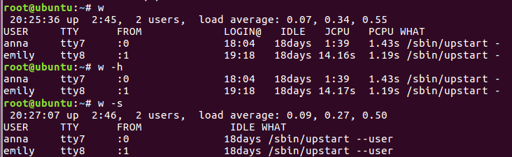

# Module 5 Linux Essentials 

## TASK 5.1

### Task1.Part1

All the tasks were performed on Ubuntu 14.06. 
1) I logged in as superuser, using `sudo -s` command.
2) The password for superuser was changed using `passwd`. The hashed values of passwords are stored in a file */etc/shadow*.
In the screenshot below you can see the content of */etc/shadow* file before and after I changed the password.


The file before changing password shows that for root user last time password was changed on February 15th, 2021 (it’s indicated by number 18670, the number of days since January 1st, 1970) and the maximum password age is 99999 by default. The file after changing password shows hash of a new password, and it shows that system used SHA-512 hash algorithm with salt that is placed between the second and third symbol $. 

3) To determine the users registered in the system I executed `w` utility. The header shows: the current time, how long the system had been running, how many users were logged on, and the system load averages for the past 1, 5, and 15 minutes. Also, this command displayed for each user his login name, the tty name, login time and so on.


4) To change personal information about my current user the `chfn` command was utilized. 

5) Examples of the previously discussed commands with keys

Personally, I suppose that `passwd` command is one of the most important for administration purposes, that’s why I decided to explore it more. I changed the password for the user *Emily* so that it will expire after 30 days, become inactive after the expiration date and the user will receive a warning two days before the expiration date. 

 

Then, I used option `-e` to force expire the password.


Next, I explored `w` utility with keys. First key that I used `-h` hides the header, second one `-s` prints the output in the short format. It doesn’t print the login time, JCPU or PCPU times.
 


6) In order to view the contents of files .bash*, I found files that match this pattern and then viewed them using `less` and `more`. My preference would be to use only `less` because it doesn’t pollute the terminal window.  


7) I added a ~/.plan file and wrote the sentence “I’m working on laboratory work 1.” to add plan to the user. Additionally, in the screenshot below, you can see the personal information that I had added at the forth step.


8) To list the contents of the home directory the `ls -pa` command was used. Option `-a` displays all files including hidden, option `-p` adds ‘/’ after directories so it would be easier to distinguish them from files. 


### Task1.Part2

1) I used `tree` command to list only those files that match the wild-card pattern and ignore case differences between the patterns and the files ([screenshot](./Images/Screenshot9.png)). To display list of subdirectories of the root directory up to and including the second nesting level the command `tree -L 2` was used.

2) To determine the type of files I used a `file` command. In the screenshot below, the first two commands show the original file extension and type. Then I tried to view the files type after I had changed files extension (last two commands). The result was the same. 


3) To go back to my home directory from anywhere in the filesystem I can use `cd ~` command.

4) An example of using `ls` command is presented in the screenshot below. Option `-a` lists all files including hidden, `-l` lists a file in long format, `-S` sorts by file size and `-h` displays file size in human readable format.


5) All the sequence of operations in the exercise was performed. 


6) All the sequence of operations in the exercise was performed. In the screenshot below information about created files is presented. First file was a hard link, it had the same permission as the original file and also, it’s shown that there were two hard links. Second file was a symbolic link, it visually showed link to the labwork2 file. 


When I changed file via soft link, all other files also changed. The reason why it happened was that soft link isn’t an actual file it’s just pointing to it. After deleting the file “labwork2”, a soft link wasn't working, because there was no file it pointed to. Whereas hard link was working properly, because it was pointing directly to the inode.

7) Using `locate` utility I found all files that contain the “squid” and “traceroute” sequence and counted the number of this files.


8) The `fdisk -l ` command was used in order to determine which partitions were mounted in the system as well as the types of these partitions.


9) For instance, I wanted to find out how many IP addresses has my VM. I used the following command to do so.

```
ip addr | grep inet | wc -l
```

10) To find all files in the /etc directory containing the host character sequence the following command was used.

```
find /etc -name *host*
```
11) To list all objects in /etc that contain the "ss" character sequence the following command was used:

```
find /etc -maxdepth 1 -name “*ss*”
```

Another way to do this utilizing `grep` utility:

```
ls /etc | grep ss
```

The result of above-mentioned command is presented on this [screenshot](./Images/Screenshot16.png).

12) To organize a screen-by-screen print of the contents of the /etc directory was used the following command:

```
ls /etc | less
```

13) To view devices, I explored the /dev directory on my system. The type of file is the first bit on each line. Device files are denoted as the following:
- c - character
- b - block
- p - pipe
- s - socket


In order to view only the block devices, the `lsblk` utility can be used, the list of all of the PCI devices can be viewed with the help of `lspci` utility. The `lsusb` utility lists devices that are connected to USB ports. And `lsscsi` command lists the SCSI devices. Another utility that can show all connected devices is `hwinfo --short` ([example of the output](./Images/Screenshot17.png))

14) To determine the type of file in the system the `file` command is used. The command in the screenshot below allows to view a type of each file in the directory.


There are a lot of types of files in Linux:
- \- : regular file
- d : directory
- c : character device file
- b : block device file
- s : local socket file
- p : named pipe
- l : symbolic link

15) In order to view the list of the first 5 directory files that were recently accessed in the /etc directory the following command was used.


This command finds all directories in the /etc directory that had been accessed in the last hour and takes only 5 first lines.
