# Module 5 Linux Essentials 

## TASK 5.2

1) In the figure below, you can see the contents of the /etc/passwd file on my Ubuntu VM.

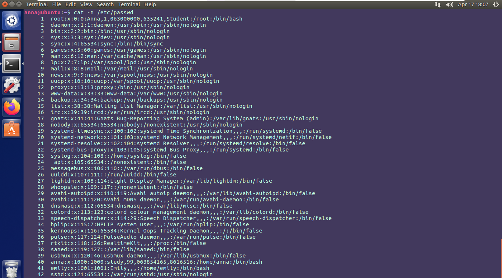
 
As you can see, each line of the file contains seven comma-separated fields:
- Username. 
- Password. This field is set to x, and the users’ passwords are stored in the /etc/shadow file.
- UID. The user identifier is a number assigned to each user. 
- GID. The user’s group identifier number, referring to the user’s primary group. Typically, the name of the group is the same as the name of the user. User’s supplementary groups are listed in the /etc/group file.
- GECOS. This field contains a list of values with the following information: user’s full name; room number; work phone number; home phone number; other contact information. This information was filled for user *root* and *anna*.
- Home directory. The absolute path to the user’s home directory. 
- Login shell. The absolute path to the user’s login shell. This is the shell that is started when the user logs into the system. 

Unix daemons typically have a name ending with a *d*, for example, you can see them in lines 19-22 in the figure above, but daemons files may not have this ending. To define daemons, it's necessary to look at its UID, they have UID from 100 to 999.  For instance, daemon *whoopsie* is installed by default in Ubuntu and it’s responsible for Error Reporting (line 28). *sshd* is user for the daemon program for ssh that listens for connections from clients.

Secondly, the file /etc/group was analyzed, each line has the following format:
- Group name. 
- Password. Generally, password is not used. This attribute set to x just like in the /etc/shadow file, it means that passwords are stored in the [/etc/gshadow file](./Images/Screenshot3.png)
- GID. Specifies the group ID.
- Group list. Identifies a list of one or more users.

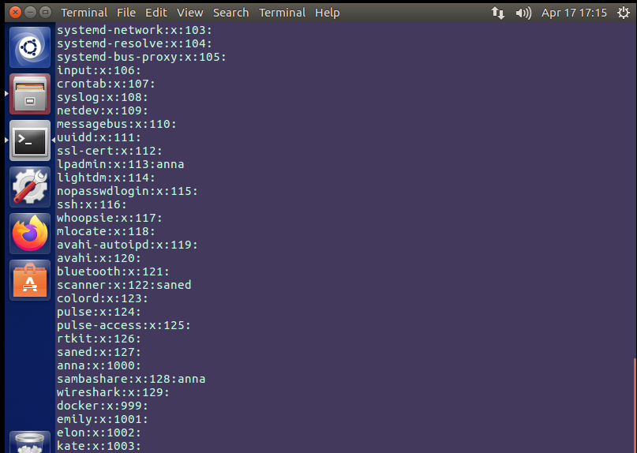

2) The range of UID is 32bit wide on Linux, i.e. 0…4294967295.
- 0 – the *root* super-user
- 1..99 – system users that should be statically allocated by the system.
- 100…999 – this range reserved for dynamic allocation by system administrators and post install scripts. These are users that do not map to actual “human” users, but are used as security identities for system daemons, to implement privilege separation and run system daemons with minimal privileges. 
- 1000…65533 and 65536…4294967294 – regular users.
- 65534 – the nobody UID.
- 65535 – this value is avoided because it was the API error return value when uid_t was 16 bits.

UID stands for user identifier. A UID is a number assigned to each Linux user and it should be unique. UID for all users in system can be found in the /etc/passwd file. Another way is to use `id` command that displays the UID, GID and groups of currently logged in user.

3) GID is similar to UID but is used to identify a group. It can be found in the same file as UID and also by using `id` command.

4) There are a few ways to determine in which groups a user is in. 

- `groups` command 

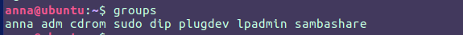

- ` id -Gn` command

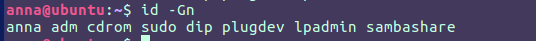

- `members group-name`

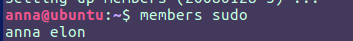

- `grep 'group-name’ /etc/group`

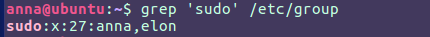

- `awk -F':' '/group-name/{print $4}' /etc/group`

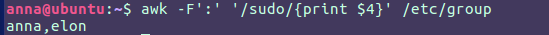

5) To create a new user `useradd` and `adduser` commands are used. The commands add an entry to the */etc/passwd*, */etc/shadow*, */etc/group* and */etc/gshadow* files. To be able to log in as the newly created user, the user password should be set, a home directory should be initiated. The difference between these two commands is that `useradd` without any options doesn’t creates home directory, doesn’t set shell and so on whereas `adduser` sets all configuration by default or asks user to enter it. 

 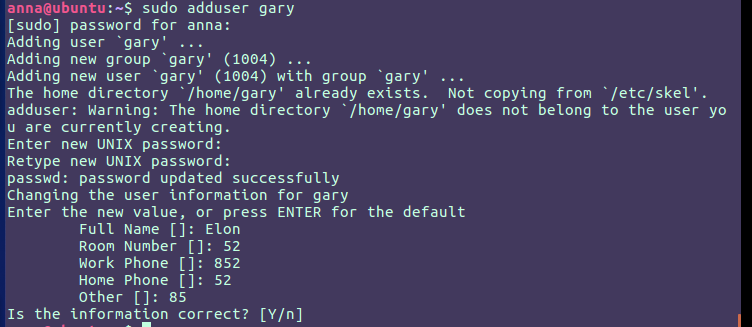

6)  In order to change user name the `usermod -l ` command needs to be executed with option. Additionally, it would be better to change name of primary user group and home directory as shown in the screenshot below.

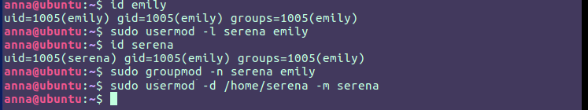

7) The /etc/skel directory contains files and directories that are automatically copied over to a new user's home directory when such user is created. The contents of this directory are presented below.

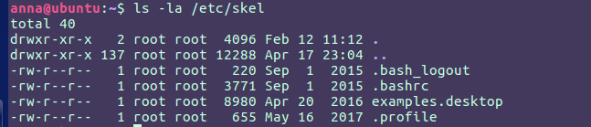

8) To remove a user including his mailbox the command `deluser --remove-home` should be used.

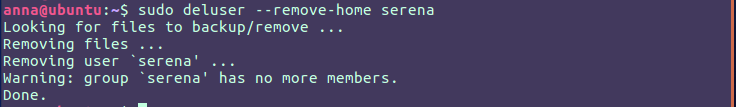

9) Keys that should be used to lock and unlock a user account are `-L` to lock and `-U` to unlock.

10) In order to force user to change his password on next login one of these commands can be used: `passwd -e` or `chage -d 0`. 

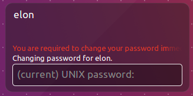

11) To display the extended format of information about the directory the next command was used `ls -ild /`.

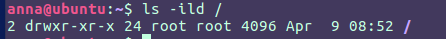

It has the following format: 
- index number of directory
- type of file and permission 
- number of hard links to the file
- file owner
- file group
- file size
- last directory modification date and time
- file name.

12) Existing access rights:

 r – The directory’s contents can be shown. The file can be read.

w – The file can be changed or modified. The directory’s contents can be altered. (e.g. User can create new files, delete files etc.)

e – The file can be executed. The directory can be navigated using `cd`.

s – If found in the user triplet it sets the SETUID bit. If found in the group triplet, it sets the SETGID bit. The file is executed with the file’s owner or group privileges. When the SETGID flag is set on a directory the new files created within it inherits the directory group ID (GID), instead of the primary group ID of the user who created the file. SETUID has no effect on directories.

t – It sets the sticky bit. This flag is useless on files.
 
13) In order to find out who is the owner of the file the `ls -l` command is used. 

14) Command `chown` used to change the owner of a file (directory).

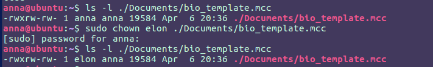

Command `chmod` used to change permission to the file. In the figure below you can see that I added SUID, SGID, allowed full access for owner and primary group, but removed all permissions for others. 

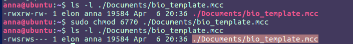

15) At the screenshot above you can see that I set permissions using octal representation. It’s four-digits number, the first digit represents that SUID, SGID was set, the second digit represents the permissions of the file’s owner, the third one the file’s group, and the last one all other users. 

    The umask value contains the permission bits that won’t be set on the newly created files and directories. To view the mask value the `umask` command should be executed without any arguments.

16) A file with SUID/SGID always executes as the user/group who owns the file, regardless of the user passing the command. The common example of this type of permissions is command passwd with binary file */usr/bin/passwd*.
The *sticky bit* restricts file deletion at the directory level. Only the owner (and root) of a file can remove the file within that directory. The common example of this is the /tmp directory.

17) In order user could run script he should have at least write and execute permissions.

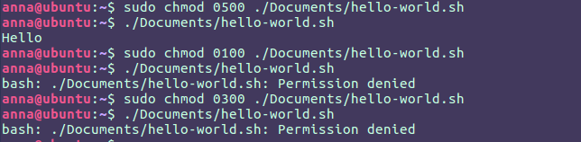

