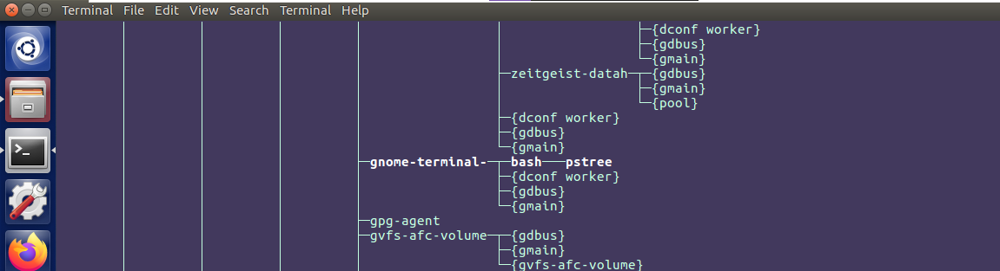
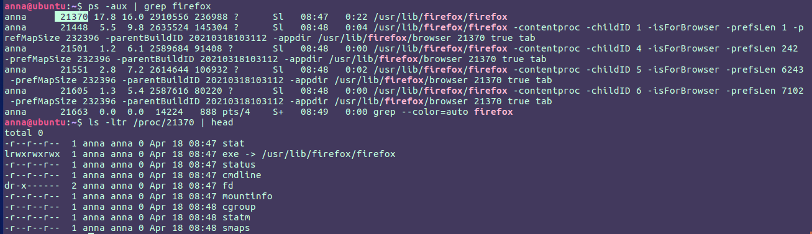

# Module 5 Linux Essentials 

## TASK 5.3

### Part 1

1) In Linux operating systems processes can be in one of the following states:
    1. Running & Runnable
    2. Interruptible
    3. Uninterruptible 
    4. Stopped
    5. Zombie

2) To highlight the chain of current process the `pstree -h` was used.

3) Procfs (Proc File System) is a virtual filesystem. It doesn’t contain real files but contains information about the running system (system memory, connected devices, hardware configuration). It provides information about processes and other system information in a hierarchical form. In linux, /proc includes a directory for each running process, including kernel processes. In the figure below it’s shown that I got the PID of running process *firefox* and checked whether /proc file system had an entry for this process.

I utilized `procinfo` utility to view system information collected from /proc directory ([screenshot]( ./Images/Screenshot3.png)).

4) There are a lot of way to find information about the processor, one of them is to use above-mentioned procfs [` /proc/cpuinfo`](./Images/Screenshot4.png), another one is [`sudo dmidecode -t 4`]( ./Images/Screenshot5.png).

5) In order to get detailed information about the processes I used `ps -AFlj` command. In addition, I used my own format to display processes ` ps -Ao pid,uid,gid,user,group,pgid,args`.

 

6) The `ps` displays a command name stored in the kernel in square brackets. Ordinary processes will not normally show up with square brackets around them in the `ps` listing.

7) I printed the list of processes to the terminal by executing `top` command. Column **S** displays processes state, 

A lot of processes had **S** state this means that they were in *interruptible sleep*, it will wake up from the middle of sleep and process new signals sent to it. Also, I saw one running process *top*, it was the current process in the system, the CPU executes a process. And letter *I* in state column means it’s idle kernel threads

8) To display only the processes of a specific user the option `-u` should be used.

9) The `procps` is a package containing a set of console applications for monitoring and terminating system processes, information about application processes is obtained from the /proc directory. Procps includes ps, free, skill, pkill, pgrep, snice, tload, top, uptime, vmstat, pidof, pmap, slabtop, w, watch, pwdx and pidwait. Such utilities as `pgrep`, ` ps`, ` top` can be used to analyze existing running tasks. There are other utilities to check running process such as `htop`, `Iotop`.

10) Top command provides a dynamic real-time view of the running system.

11) To display the processes of the specific user using the top command I executed ` top -U anna` command.

12) There are many interactive options in `top` utility:
- *z* displays running process in color which may help user to identify running process
- *c* displays absolute path of running process
- *k* kills the process
- *r* changes the priority of the process
- *t* changes the display format of the CPU

13) By default, the process list is sorted by the %CPU column. It can be changed by pressing the following:
- P: The %CPU column.
- M: The %MEM column.
- N: The PID column.
- T: The TIME+ column.

In the figure below the processes are sorted by memory usage.

14) Commands `nice` and `renice` are used to set priority.

15) The priority of a process in `top` command can be changes using r option.

16) There are a few ways how to kill the process: 
- `kill PID`
- `kill -s SIGNAL PID `
- `kill -SIGNAL_NAME PID `
- `kill -SIGNAL_NUMBER PID `

Commonly used signals are:
- 9 – SIGKILL
- 15 – SIGTERM
- 1 – SIGHUP
- 19 – SIGSTOP

17) Jobs control commands enable user to place jobs in the foreground or background, and to start or stop jobs. Also this command can be used to list running jobs.

`bg` command places the current or specified job in the background and `fg` brings the current or specified job into the foreground.

`sleep` command is used to create a dummy job. A dummy job helps in delaying the execution. For instance, user might want to run a couple of commands one after the other, but with a certain amount of delay between them and user can use `sleep` command for this purpose. I used ` sleep 10m; reboot ` command to reboot my VM in 10 minutes. 

The example of controlling process of `sleep` command is presented below. 

Here I stopped `sleep` command and resume the sleep job in the background, after I’d done that I moved it to the foreground by using the `fg` command. The same actions I repeated for `yes` command.

### Part2

1. The most important and frequently used OpenSSH command is `ssh`. It’s used to establish a secure remote connection with servers. In the figure below is shown how I used this command to connect to ssh-server on Ubuntu with IP address 192.168.0.108.

Second most used command is `ssh-keygen`. Ssh-keygen is a tool for creating new authentication key pairs for SSH. Such key pairs are used for automating logins, single sign-on, and for authenticating hosts. I chose to use my own file name with the help of *-f* option and also, I set *ecdsa* algorithm with 521 bits. The result of execution the command is shown below, as a result the two keys public and private were created. 

Another common command is `ssh-agent`. The ssh-agent is a helper program that keeps track of user's identity keys and their passphrases. The agent can then use the keys to log into other servers without having the user type in a password or passphrase again. As shown in the screenshot below, I enabled ssh-agent, configured manual startup type, started the service and loaded key file into ssh-agent.

After some additional configuration (editing /etc/ssh/sshd_config file and coping public key on server) I successfully logged in via ssh connection.

2) I edited */etc/ssh/sshd_config* file to implement basic SSH settings to increase the security of the ssh connection. The next lines were edited:
- *port 64344*
- *PasswordAuthentication no*
- *PermitRootLogin no*
- *PrintLastLog no*
- *ListenAddress 192.168.0.157*

After this configurations, client could connect to ssh server only from 192.168.0.157 IP address using port 64344. Moreover, user wasn't able to use password to authenticate. In the screenshot below you can see that I used option `-p` to set port and Welcome message didn’t include last login date and time.

3) To generate public and private keys I executed the following command:

The algorithm is selected using the -t option, key size using the -b option and the file in which to store the key was specified on the command line using the -f option.

4) I implemented port forwarding for the SSH client from the host machine to the guest Linux virtual machine behind NAT. Host machine had 192.168.0.157 IP address, VM had 192.168.240.130 and ssh configured on 64344 port.

The -L switch specifies local forwarding. Local port forwarding allowed me to forward traffic on a port of my local computer to the SSH server, which is forwarded to a destination server. Any traffic arriving on port 41654 is sent to the SSH server. Then, the received traffic will be sent to 45419 port of 192.168.240.130, which is the server itself.

5) I intercepted traffic with Wireshark tool while authorizing the remote client on the server using ssh, telnet, rlogin. First, I analyzed traffic during authentication with telnet and rlogin network protocols, as expected, all information was in a plain text including user login and password. 

    In the following figure you can see that I restored data from captured traffic utilizing the Follow TCP Stream feature of Wireshark when telnet protocol was used.

I saw the same result when I analyzed traffic during rlogin authentication. What I noticed was that each symbol that I entered on the client was send in separate TCP segments whereas information from server was send in one segment. In the screenshot below it is shown that message from server *”Password:”* was placed in one segment with number 236 and entered password symbols was sent one-by-one in separate segments (242, 247, 251 etc.). 

Additionally, I restored data using the Follow TCP Stream feature. 

Finally, I analyzed SSH traffic. As shown in the following figure, first, client and server exchanged software versions and supported encryption and hashing algorithms (the process of negotiating parameters). Then server authenticated the client. The main difference between SSH and Telnet or Rlogin is that SSH provides a fully encrypted and authenticated session.

