# Module 6 Networking with Linux

## TASK 6.1

On the VM1 I had Ubuntu 16.04 and on the VM2 and VM3 I had Ubuntu 20.04.
Addressing table is shown below.

|     Device    |     Interface           |     IP Address         |     Subnet Mask      |     Default Gateway    |
|---------------|-------------------------|------------------------|----------------------|------------------------|
|     Host      |     Wireless network    |     192.168.0.157      |     255.255.255.0    |     192.168.0.1        |
|     VM1       |     Ens33 (NAT)               |     192.168.240.132    |     255.255.255.0    |                        |
|               |     Ens38 (LAN)               |     10.10.10.1         |     255.255.255.0    |                        |
|     VM2       |     Ens33               |     10.10.10.2         |     255.255.255.0    |     10.10.10.1         |
|     VM3       |     Ens33               |     10.10.10.3         |     255.255.255.0    |     10.10.10.1         |

Firstly, I configured two interfaces (LAN and NAT) on the VM1. The interface ‘ens33’ had got the dynamic IP address 192.168.240.132/24 whereas the interface ‘ens38’ was without IP address so I assigned the static IP address 10.10.10.1/24 with mask for this interface. For this purpose, I made corresponding changes in the */etc/network/interfaces* file.  

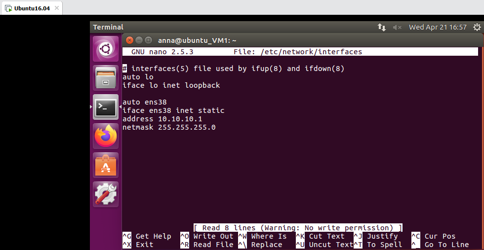

All interfaces on the VM1 are shown on the figure below.

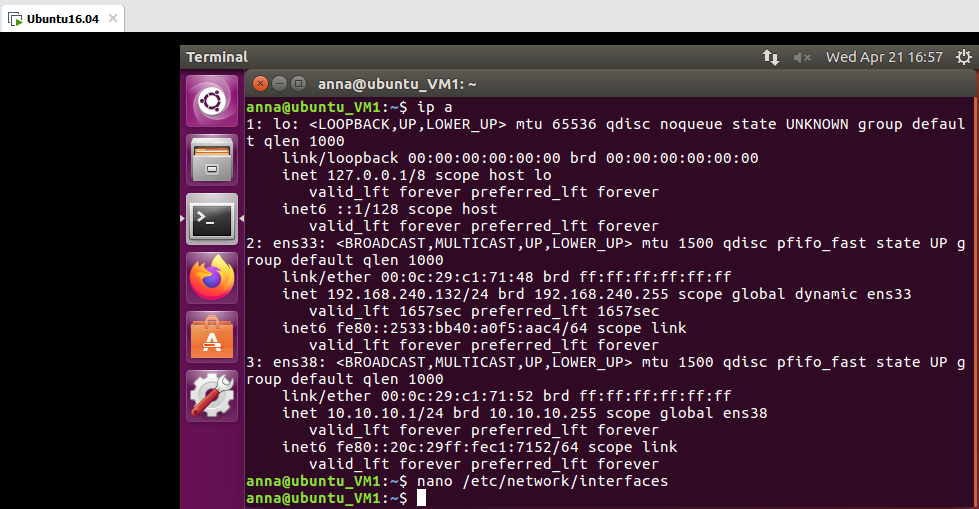

Secondly, it was necessary to enable port forwarding. The first thing I had done was check the state of port forwarding, the result was 0 what means that port forwarding was turned off. To turn it on I executed the following command:

```
sysctl -w net.ipv4.conf.all.forwarding=1
```

So that after restarting the system it didn’t reset, I inserted the *net.ipv4.conf.all.forwarding=1* line into the */etc/sysctl.conf* file.

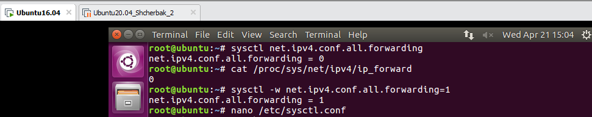

Then, I added the NAT rule to the `iptables` to tell iptables how to route traffic from the internal network. And I saved this configuration by using `netfilter-persistent save` command.

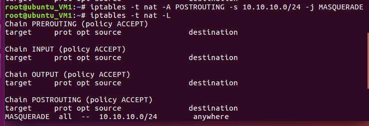

Once I had done this, I proceeded to configure the IP addresses statically on the VM2 and VM3. To do so, I edited the */etc/netplan/01-network-manager-all.yaml* file. The example of this file on the VM2 is shown below.

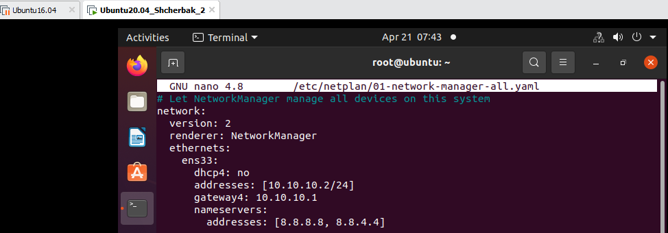

The result of above-mentioned configuration is presented in the figures below. 

VM2

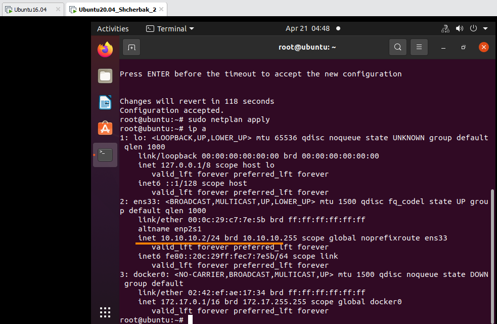

VM3

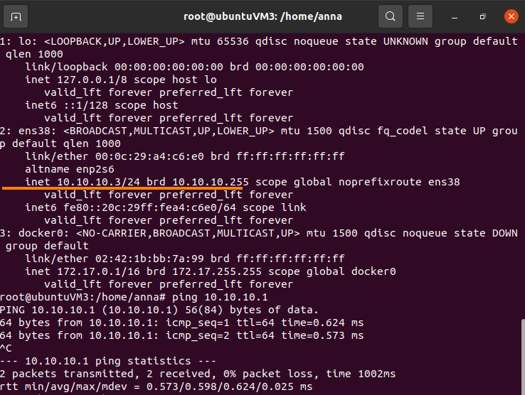

I checked the route from VM2 to Host by using `traceroute` command.

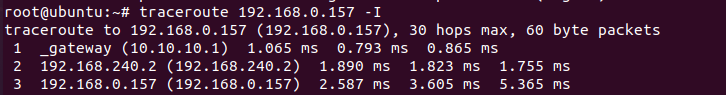

Then I checked the access to the Internet by pinging the google.com.

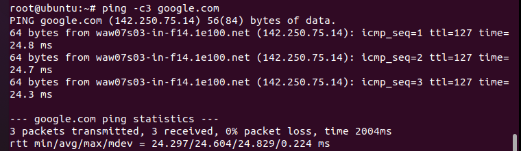

On the VM2 I executed the following commands to determine which resource has an IP address 8.8.8.8. This IP address has dns.google.

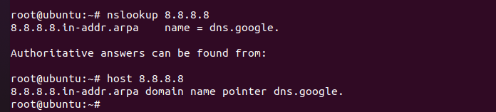

The IP address 3.214.134.159 belongs to [epam.com](https://www.epam.com/).

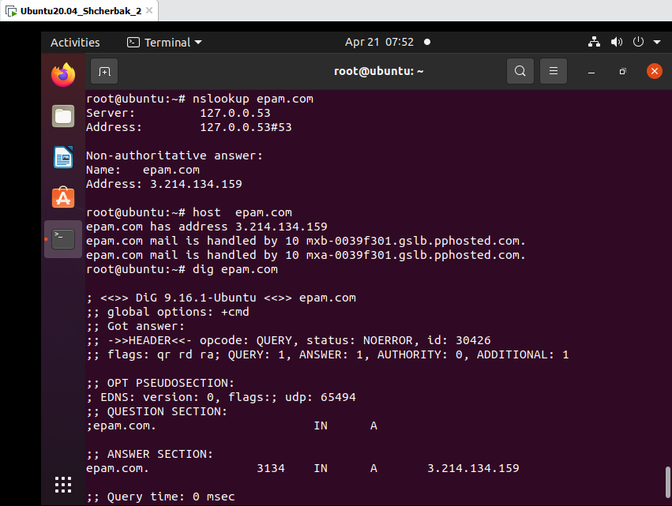

The default gateway for my HOST is 192.168.0.1 (it’s the IP address of the router).

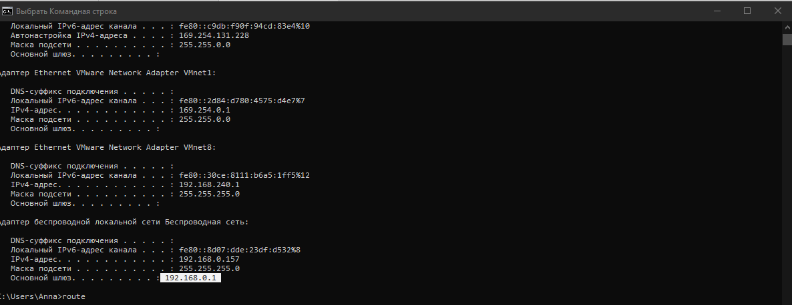

The part of routing table on my HOST is shown in the figure below.

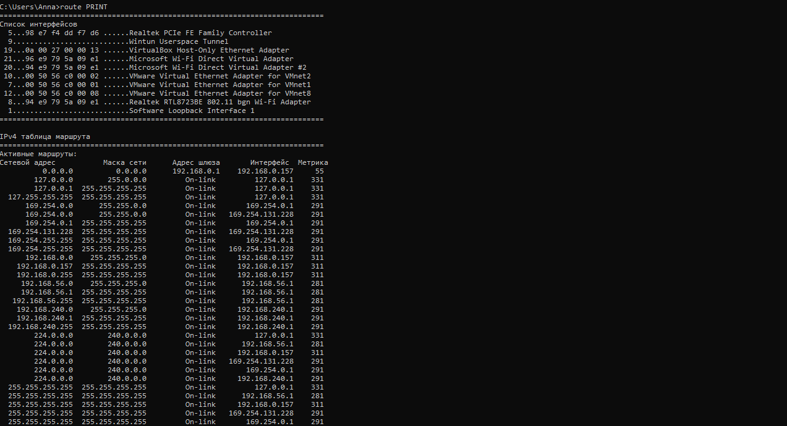

The result of `traceroute` to [google.com](https://www.google.com/) from the VM2.

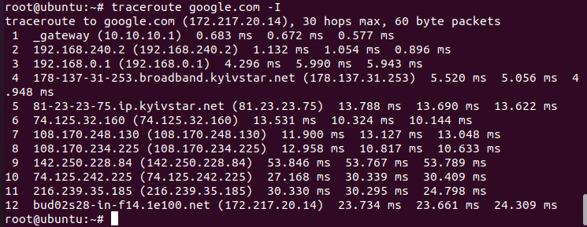

