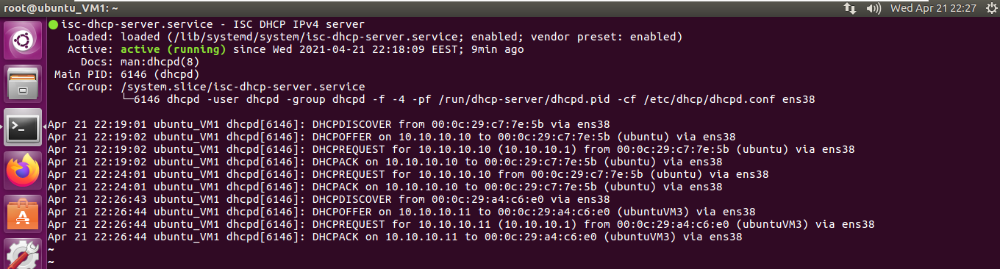

# Module 6 Networking with Linux

## TASK 6.2

On the VM1 I had Ubuntu 16.04 and on the VM2 and VM3 I had Ubuntu 20.04.
Addressing table is shown below.

|     Device    |     Interface           |     IP Address         |     Subnet Mask      |     Default Gateway    |
|---------------|-------------------------|------------------------|----------------------|------------------------|
|     Host      |     Wireless network    |     192.168.0.157      |     255.255.255.0    |     192.168.0.1        |
|     VM1       |     Ens33 (NAT)               |     192.168.240.132    |     255.255.255.0    |                        |
|               |     Ens38 (LAN)               |     10.10.10.1         |     255.255.255.0    |                        |
|     VM2       |     Ens33               |     dynamic         |     255.255.255.0    |     10.10.10.1         |
|     VM3       |     Ens38               |     dynamic         |     255.255.255.0    |     10.10.10.1         |

The first DHCP server I configured by using the **isc-dhcp-server** utility. I edited the default configuration file of DHCP server */etc/default/isc-dhcp-server* to assign the network interface. 


Then, I edited */etc/dhcp/dhcpd.conf* file and defined the subnet, IP range, default gateway and domain name servers.


Having done that, I restarted the DHCP server by using `systemctl restart isc-dhcp-server` command and checked its status.



On the VM2 and VM3 I edited the */etc/netplan/01-network-manager-all.yaml* file so that both VMs used dynamic IP address.


The dynamically assigned IP addresses on the VM2 and VM3 are shown on the figures below.

VM2


VM3


In addition, I configured another DHCP server that was **dnsmasq**. I edited the */etc/dnsmasq.conf* file to setup the DHCP server. I defined the IP range, default gateway and interface. 


Then I checked the dynamically assigned IP addresses on VM2 and VM3.

VM2


VM3


 I verified status of the dnsmasq server.


Besides, I checked the list of current clients that received IP addresses from DHCP service.


The next step was to setup a DNS server I did this by using `dnsmasq` utility. Updated file *dnsmasq.conf* is shown in the figure below.


Then I edited the */etc/hosts* file to assign the DNS records for VM2 and VM3. The following lines were added:

```
10.10.10.29 vm2.mydomain.com
10.10.10.26 vm3.mydomain.com
```


Also, I added *nameserver 127.0.0.1* line to the */etc/resolv.conf* file.

Then, I verified configuration of the DNS server. First, I executed `dig` commands on the VM1.


I checked the ability of the VM2 and VM3 for gaining access to DNS server.


