# Module 7 Linux administration with bash

## TASK 7.1

### Task A

I created script that uses the following keys:
1. When starting without parameters, it displays a list of possible keys and their description.
2. The --all key displays the IP addresses and symbolic names of all hosts in the current subnet
3. The --target key displays a list of open system TCP ports. By default this key displays for localhost, otherwise if a target IP is given, its open TCP ports are displayed. In addition, script checks the correctness of the given IP address. 

The file with script [here](./scriptA).

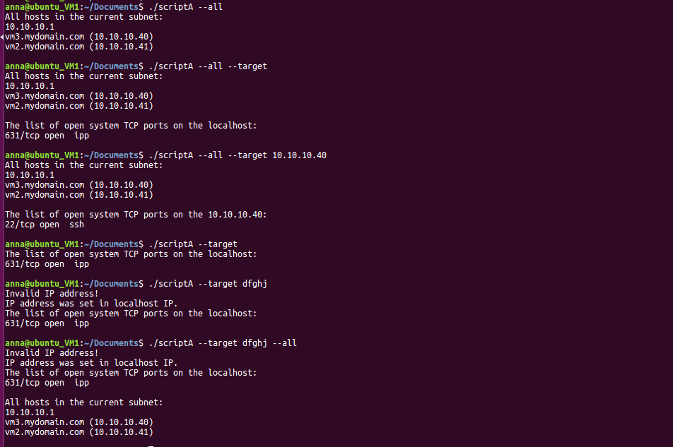

### Task B

The IP address from which the most requests were sent, as well as the contents of the script file, are shown in the figure below.

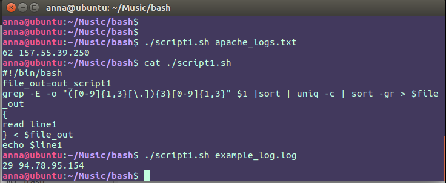

The most requested page is /sitemap1.xml.gz

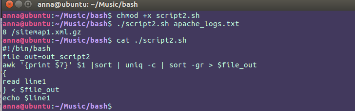

The same result can be achieved another way by using `cut` utility instead of `awk`.

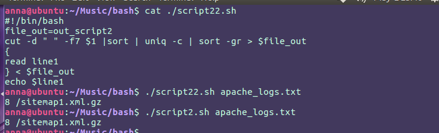

The number of requests from each IP is: 

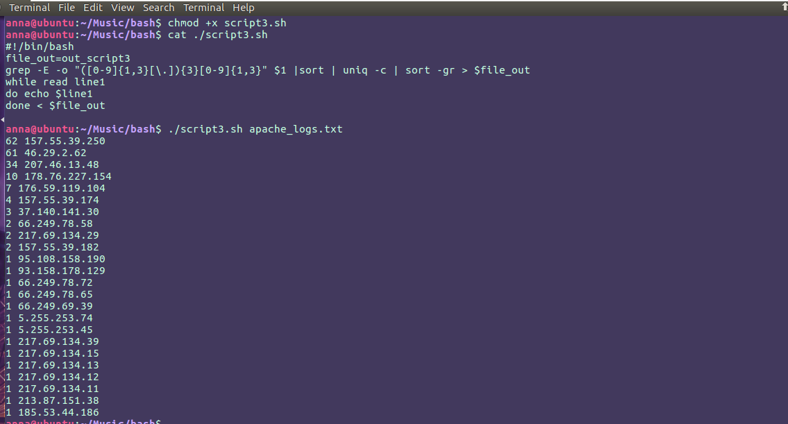

The same result can be achieved using `awk` utility.

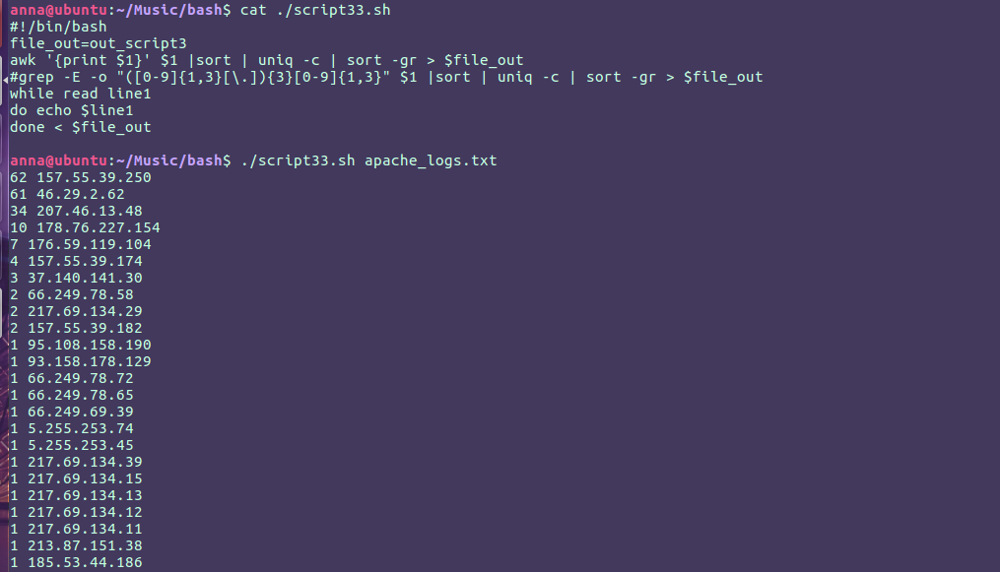

To find non-existent pages that users have tried to access, I filtered log file by 404 status code. The result didn’t show any such log record from the “apache_logs.txt” log file, but there were such records in the “example_log.log” log file.

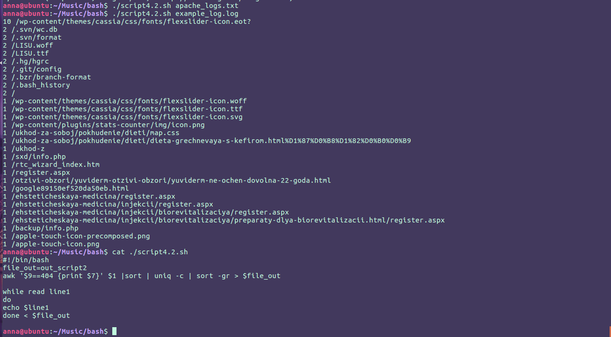

In addition, I tried to filter log records by 302 status code. HTTP status code of 302 means the page the user is trying to access has been temporarily moved to a different location. The result showed two webpages */vote/1353* and */vote/1279*. 

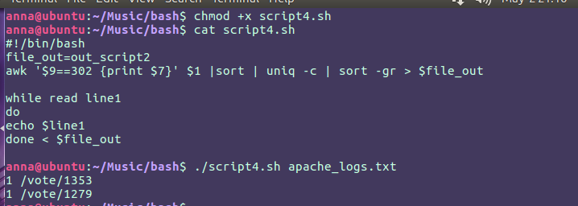

If there are several moments in time with the same number of requests, the script will print it all. As it’s shown in the figure below there were twelve times (based on h/m/s time format) with the same number of requests.

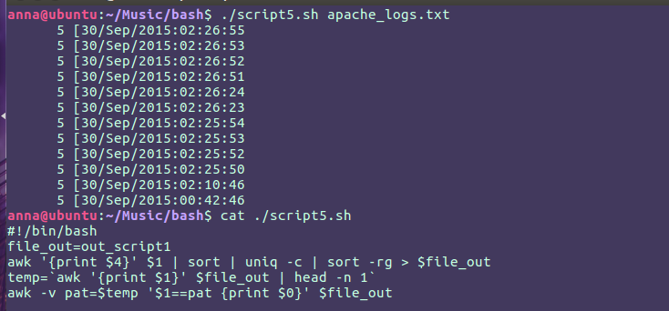

Also, I displayed the hour with the most requests.

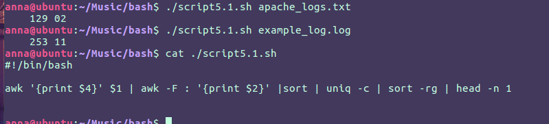

Well-behaved bots identify themselves is the user agent portion of the combined log format. This makes it relatively straightforward to isolate log entries created by good bots. The result is shown below. 

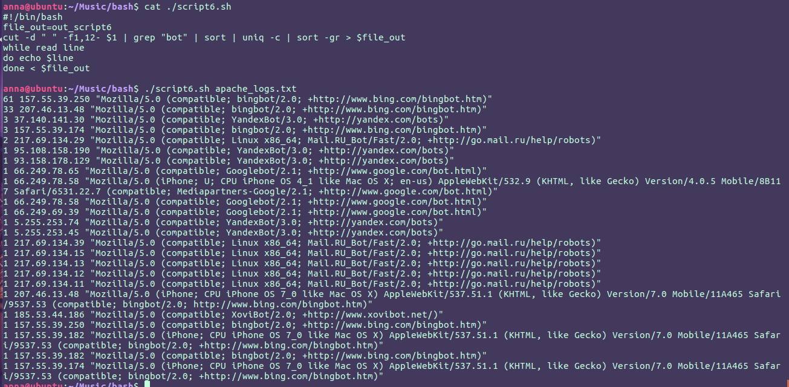

