# Module 8 CICD

## TASK 8.1

Firstly, I installed Jenkins on the master machine (Ubuntu 16.04).

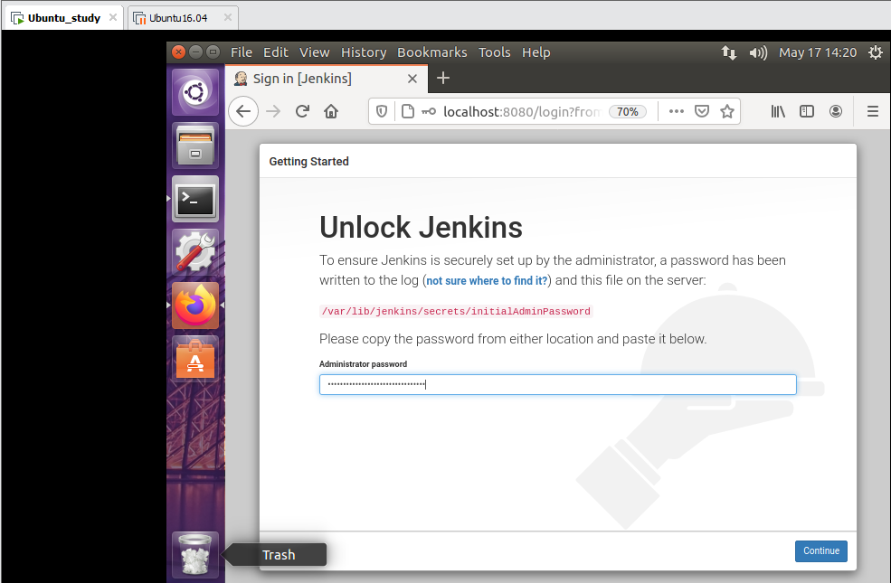

I created the first job “simple job” that just prints a few lines using *echo* command.

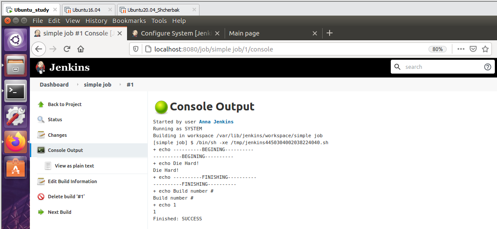

I created the second job example “job_deploy1” in Jenkins with deploy.

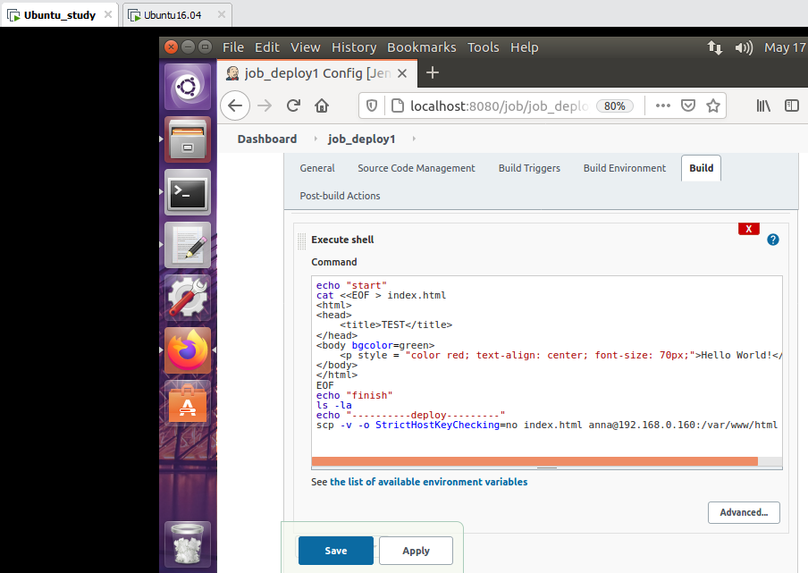

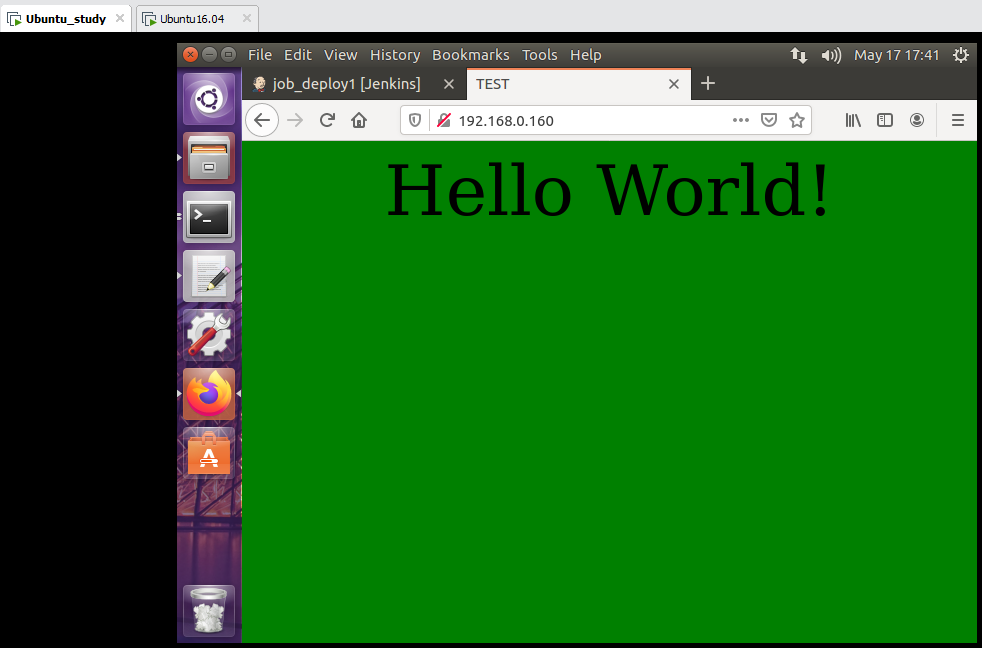

Then I configured a plugin “Publish Over SSH”.

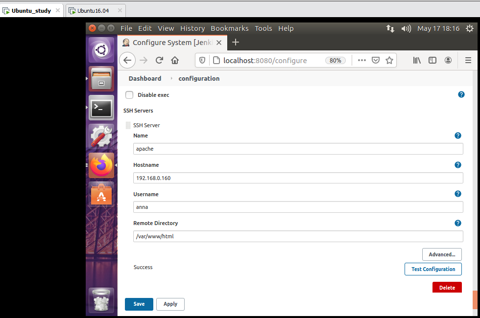

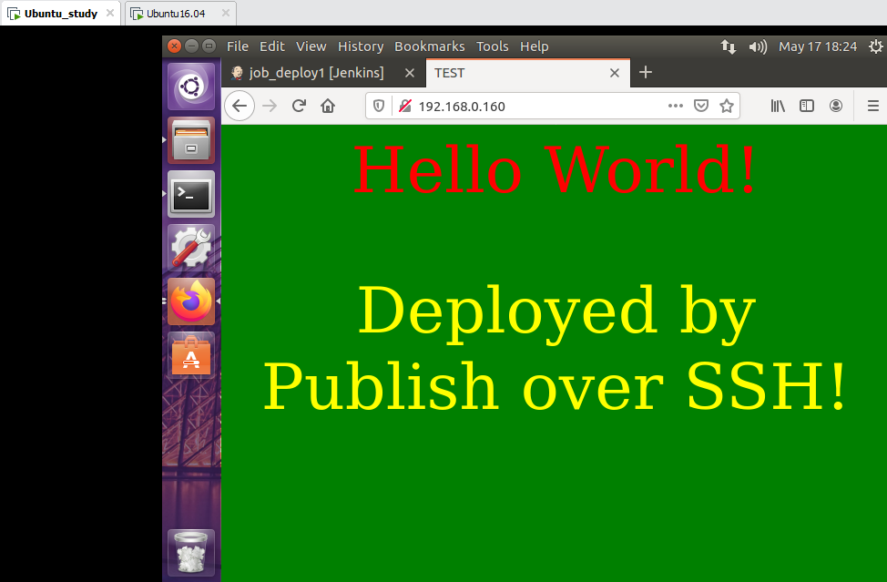

I created a simple CI/CD pipeline example.

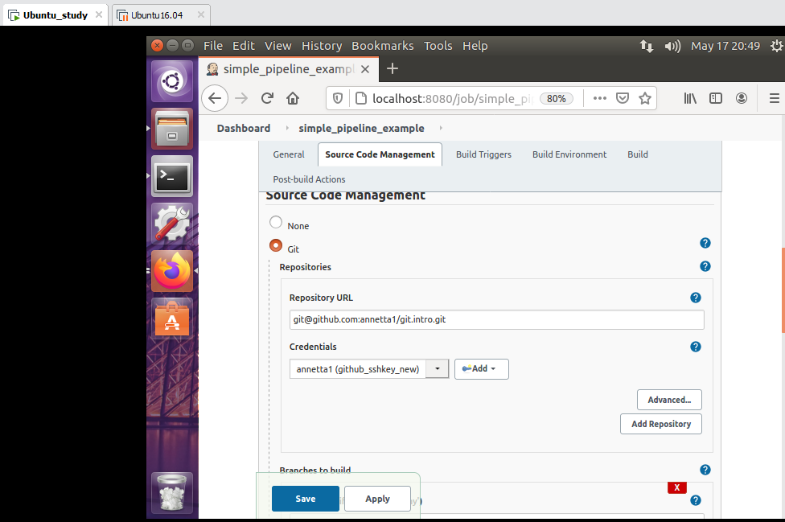

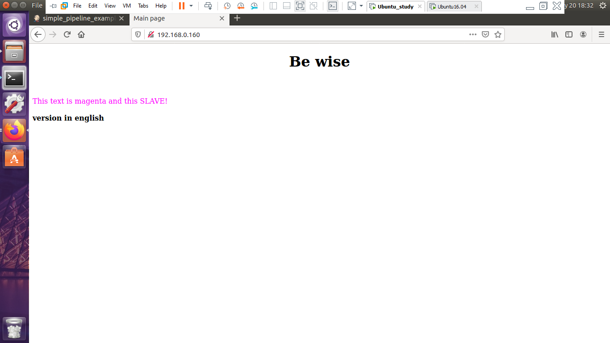

The next step was to configure nodes (slaves). I copied public key from master Jenkins to slaves, created on them directory “jenkins” and installed Java jdk. First slave had IP address 192.168.0.160, second one had 192.168.0.169.

The example of slave1 is presented in the figure below.

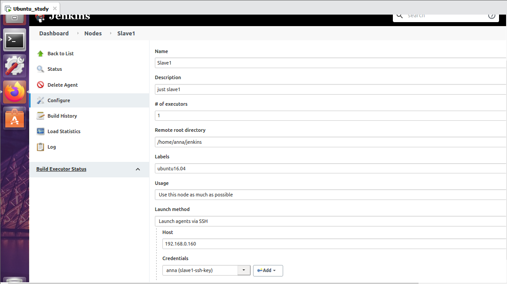

I created a simple job “simplejob2” to run on the slave1.

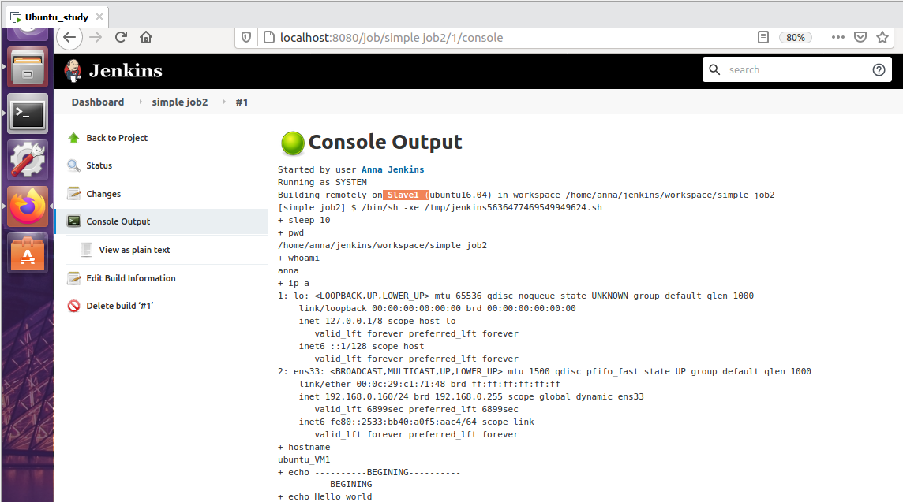

Also, I created simple Jenkins pipeline with pipeline script from SCM.

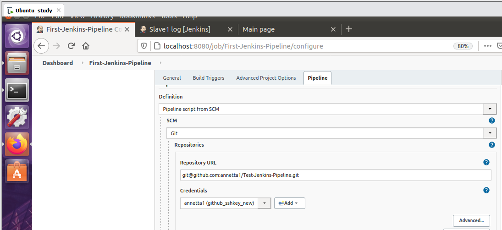

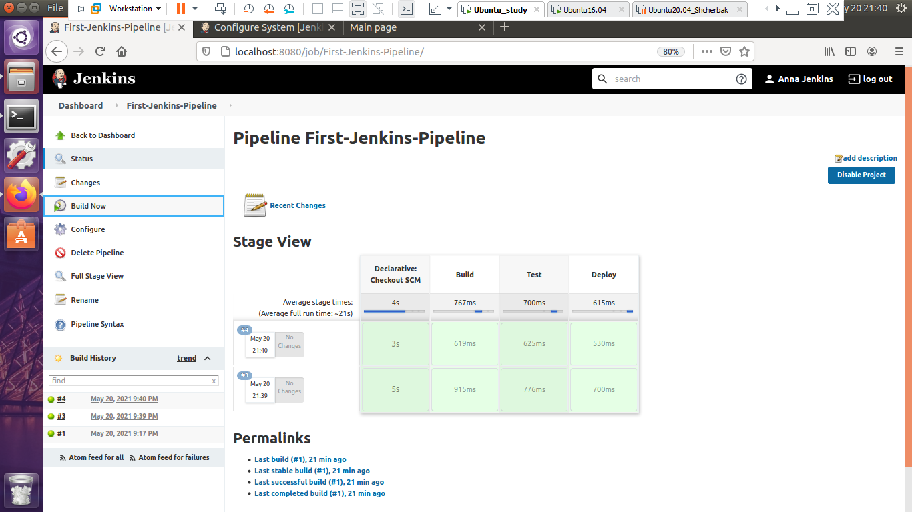

