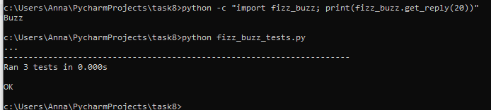
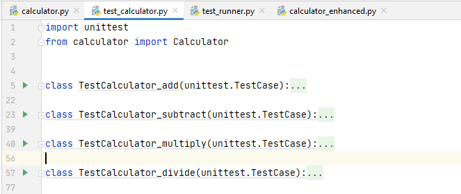
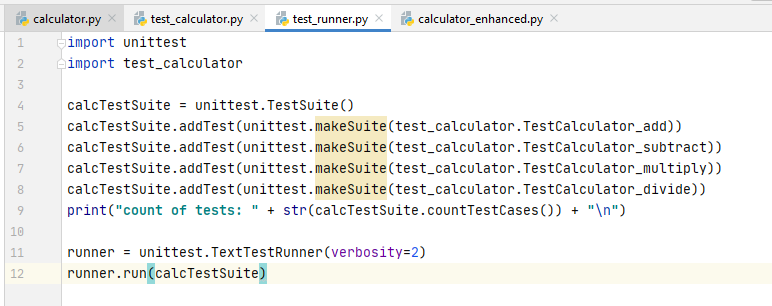
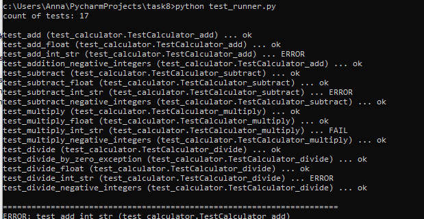
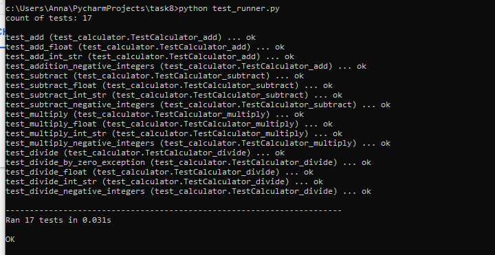

# Module 9 Python Essentials

## TASK 9.1

First, I launched unit test for fizz_buzz.py, the result presented in the figure below.

Secondly, I wrote unit test for the given [*calculator.py*](./calculator.py) file. I wrote four test cases for four calculator functions, as a result I had a file [*test_calculator.py*](./test_calculator.py) with four classes. 

Then I organized all tests cases in a test suite and initialized the test runner, consequently I had a new python file [*test_runner.py*](./test_runner.py).

Finally, I ran the unit test and got my results. There were a few failures as it’s shown in the figure below.

So, I decided to make a few adjustments to get everything working. A new file was thus created [*calculator_enhanced.py*](./calculator_enhanced.py).

I ran the unit test again and there were no errors. 

